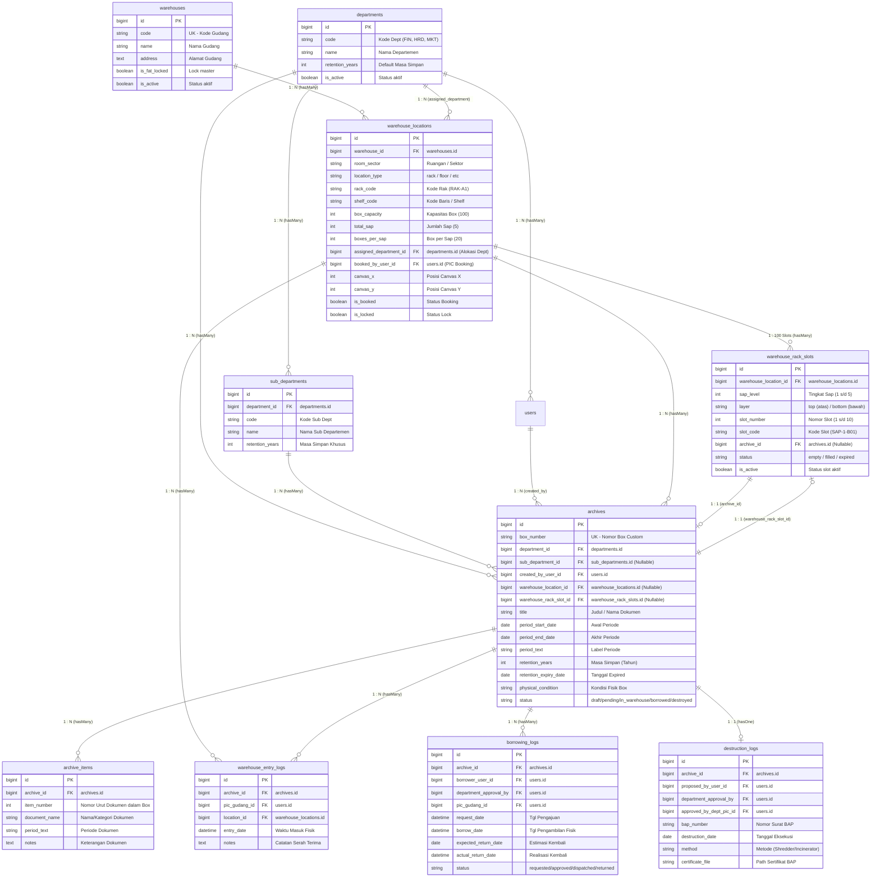

# Document Management System (DMS) / Gudang Arsip PT Indraco (Laravel 7 Edition)

<p align="center">
  
</p>

Aplikasi **Document Management System (DMS) / Sistem Manajemen & Gudang Arsip PT Indraco (Laravel 7 Edition)** dirancang untuk mengelola siklus hidup fisik dan digital dokumen/arsip perusahaan secara terpusat, aman, dan teratur. 

Sistem ini memfasilitasi setiap departemen di PT Indraco dalam pencatatan draft dokumen, pemesanan (booking) lokasi penyimpanan di gudang arsip, penomoran box otomatis berformat custom, peminjaman dokumen, hingga pengawasan masa simpan (*retention expiry*) dan alur berita acara pemusnahan dokumen (BAP).

---

## 🌟 Fitur Utama & Keunggulan

### 1. Dynamic Custom Box Code Engine
Engine generator nomor box arsip otomatis berbasis format template yang dapat disesuaikan tanpa perlu mengubah kode program.
- **Pattern Default:** `{COMPANY}/{DEPT}/{YEAR}/{ROMAN_MONTH}/{COUNTER}` &rarr; `IND/FIN/2026/III/0001`
- **Placeholder Terdaftar:** `{COMPANY}`, `{DEPT}`, `{YEAR}`, `{ROMAN_MONTH}`, `{COUNTER}`, `{COUNTER_BOX}`.

### 2. Workflow Alur Operasional End-to-End
- **Pengajuan & Booking Storage (PIC Departemen):** Penginputan metadata berkas, range tanggal periode (e.g. *Januari - Maret 2026*), masa simpan retention (tahun), kondisi fisik wadah, rincian dokumen, dan upload lampiran berkas digital.
- **Hub Verifikasi & Penomoran (PIC Gudang):** Pengecekan kesesuaian berkas fisik oleh kurator gudang, penolakan revisi, atau persetujuan yang secara otomatis men-generate Nomor Box Custom.
- **Check-in & Penempatan Rak Gudang:** Penempatan fisik box ke slot rak gudang (`RAK-A1 BARIS-01`), pemantauan kapasitas rak, dan pencatatan **Log Masuk Gudang**.
- **Alur Peminjaman & Pengembalian Dokumen:** Pengajuan pinjam berkas, approval kurator, pengeluaran fisik (*dispatch*), dan konfirmasi pengembalian berkas ke gudang.
- **Retention Expiry & Berita Acara Pemusnahan (BAP):** Alert notifikasi otomatis untuk dokumen yang mendekati/melewati masa simpan (&le; 90 hari), pencatatan BAP, upload sertifikat pemusnahan, dan pencetakan dokumen resmi BAP dengan blok tanda tangan 3-kolom.

### 3. Interactive 2D Warehouse Layout Canvas
Visualisasi denah fisik 2D gudang arsip interaktif pada menu `/master/warehouses/layout` untuk inspeksi kapasitas rak, alokasi departemen, dan booking slot tempat arsip.

### 4. Desktop UI Edition untuk PIC Departemen (Delphi / VB Style)
Antarmuka khusus role PIC Departemen bergaya **Desktop Workstation Form App** dengan *MDI Tabbed Workspace*, *Delphi Action Ribbon*, *DBGrid Compact Spreadsheet*, dan integrasi pintasan keyboard (`F2`, `F5`, `F8`, `F9`, `Ctrl+F`).

### 5. Global Audit Trail Log System
Pencatatan riwayat aktivitas secara transparan:
- **Log Masuk Gudang:** Mencatat tgl masuk, PIC Gudang penerima, lokasi rak, & catatan reception.
- **Log Peminjaman:** Mencatat peminjam, alasan pinjam, tgl pinjam, estimasi kembali, realisasi pengembalian, & verifikator.
- **Log Pemusnahan:** Mencatat nomor BAP, tanggal eksekusi, metode fisik (incinerator/shredder), dan eksekutor.

---

## 👥 Hak Akses & Peran Pengguna (Role & Access Control)

| Peran (Role) | Kode System | Deskripsi & Hak Akses |
| :--- | :--- | :--- |
| **Super Admin / Management** | `admin` | Pengelolaan Master Data (Departemen, Gudang, Rak, Format Box, User & Role), melihat analisis global & seluruh audit log. |
| **PIC Gudang (Warehouse Curator)** | `pic_gudang` | Dashboard gudang, verifikasi pengajuan, penomoran box, check-in rak, dispatch peminjaman, & eksekusi BAP pemusnahan. |
| **PIC Departemen Client** | `pic_dept` | Input draft arsip departemennya, pengajuan booking storage gudang, peminjaman dokumen, & katalog khusus departemen. |

---

## 🛠️ Tech Stack & Dependensi

* **Framework Core:** Laravel 7 (PHP 7.4 / 8.0 / 8.2)
* **UI & Frontend Layout:** Tailwind CSS v3 (Corporate Navy `#0F172A` & Gold `#D4AF37`), Alpine.js, Lucide Icons
* **Database:** SQLite (Local Dev) / MySQL / MariaDB
* **Branding Assets:** Logo Resmi PT Indraco (`logo-indraco-est.png`)

---

## 🗄️ Struktur Relasi Antar Tabel & Hierarki Penyimpanan (Database Schema & Joins)

Sistem mengorganisir arsip fisik secara hierarkis dan terstruktur dari level gedung/gudang hingga ke lembar dokumen individual di dalam box.

### 1. Hierarki Fisik Penyimpanan (Storage Physical Hierarchy)

```
[ Gudang / Warehouse ] (warehouses)
       └── [ Ruangan / Sektor / Rak ] (warehouse_locations)
                 └── [ Sap / Tingkat / Baris ] (warehouse_rack_slots: sap_level 1-5, layer top/bottom)
                           └── [ Slot Nomor Fisik ] (warehouse_rack_slots: slot_number 1-10)
                                     └── [ Box Arsip ] (archives)
                                               └── [ Dokumen / Map Item ] (archive_items)
```

- **1 Gudang (`warehouses`)** memuat banyak **Rak / Lokasi Penyimpanan** (`warehouse_locations`).
- **1 Rak (`warehouse_locations`)** memiliki spesifikasi:
  - `box_capacity`: Kapasitas maksimal (default 100 box per rak).
  - `total_sap`: 5 tingkat/sap per rak.
  - `boxes_per_sap`: 20 box per sap (10 baris atas / *top*, 10 baris bawah / *bottom*).
  - `room_sector`: Sektor atau ruangan fisik tempat rak berada (misal: *Sektor A*, *Ruang 1*).
- **1 Rak** memiliki 100 slot fisik individual (`warehouse_rack_slots`) yang tersusun atas formula: **5 Sap &times; 2 Layer (Top/Bottom) &times; 10 Slot**.
- **1 Slot Rak (`warehouse_rack_slots`)** menampung tepat **1 Box Arsip (`archives`)** dengan status *empty* atau *filled*.
- **1 Box Arsip (`archives`)** dapat memuat banyak **Rincian Item Dokumen / Map (`archive_items`)**.

---

### 2. Diagram Relasi Entitas (Mermaid ERD)



---

### 3. Matriks Relasi Foreign Key & Join Antar Tabel

| No | Tabel Asal | Kolom Foreign Key | Tabel Tujuan (Target) | Kolom PK Tujuan | Jenis Relasi | Keterangan Hubungan |
| :---: | :--- | :--- | :--- | :--- | :---: | :--- |
| **1** | `warehouse_locations` | `warehouse_id` | `warehouses` | `id` | `N : 1` (Many-to-One) | Setiap rak fisik berada di dalam satu gudang/gedung tertentu. |
| **2** | `warehouse_locations` | `assigned_department_id` | `departments` | `id` | `N : 1` (Many-to-One) | Alokasi rak khusus untuk departemen tertentu (opsional). |
| **3** | `warehouse_locations` | `booked_by_user_id` | `users` | `id` | `N : 1` (Many-to-One) | User PIC yang melakukan booking kapasitas rak. |
| **4** | `warehouse_rack_slots` | `warehouse_location_id` | `warehouse_locations` | `id` | `N : 1` (Many-to-One) | Posisi slot (Sap & Layer) merupakan bagian dari rak fisik tertentu. |
| **5** | `warehouse_rack_slots` | `archive_id` | `archives` | `id` | `1 : 1` (One-to-One) | Box arsip yang saat ini menempati slot rak (NULL jika kosong). |
| **6** | `archives` | `warehouse_location_id` | `warehouse_locations` | `id` | `N : 1` (Many-to-One) | Menghubungkan box arsip dengan master rak lokasi penyimpanannya. |
| **7** | `archives` | `warehouse_rack_slot_id` | `warehouse_rack_slots` | `id` | `1 : 1` (One-to-One) | Menghubungkan box arsip dengan nomor slot spesifik di rak. |
| **8** | `archives` | `department_id` | `departments` | `id` | `N : 1` (Many-to-One) | Pemilik/departemen asal berkas dokumen. |
| **9** | `archives` | `sub_department_id` | `sub_departments` | `id` | `N : 1` (Many-to-One) | Divisi / unit kerja spesifik di bawah departemen. |
| **10** | `archives` | `created_by_user_id` | `users` | `id` | `N : 1` (Many-to-One) | User pembuat draft / pengaju booking storage arsip. |
| **11** | `archive_items` | `archive_id` | `archives` | `id` | `N : 1` (Many-to-One) | Rincian map/dokumen fisik yang tersimpan di dalam 1 box. |
| **12** | `warehouse_entry_logs`| `archive_id` | `archives` | `id` | `N : 1` (Many-to-One) | Riwayat pencatatan fisik box saat pertama kali masuk ke gudang. |
| **13** | `warehouse_entry_logs`| `location_id` | `warehouse_locations` | `id` | `N : 1` (Many-to-One) | Lokasi rak yang dituju saat box masuk ke gudang. |
| **14** | `warehouse_entry_logs`| `pic_gudang_id` | `users` | `id` | `N : 1` (Many-to-One) | Petugas PIC gudang penerima berkas fisik. |
| **15** | `borrowing_logs` | `archive_id` | `archives` | `id` | `N : 1` (Many-to-One) | Box arsip yang diajukan untuk dipinjam keluar gudang. |
| **16** | `borrowing_logs` | `borrower_user_id` | `users` | `id` | `N : 1` (Many-to-One) | Karyawan/user yang meminjam arsip. |
| **17** | `borrowing_logs` | `department_approval_by`| `users` | `id` | `N : 1` (Many-to-One) | PIC Kepala Departemen yang menyetujui peminjaman. |
| **18** | `borrowing_logs` | `pic_gudang_id` | `users` | `id` | `N : 1` (Many-to-One) | Petugas PIC gudang yang mendispatch/mengeluarkan fisik box. |
| **19** | `destruction_logs` | `archive_id` | `archives` | `id` | `1 : 1` (One-to-One) | Box arsip yang telah/sedang diproses pemusnahan (BAP). |
| **20** | `destruction_logs` | `proposed_by_user_id` | `users` | `id` | `N : 1` (Many-to-One) | Petugas yang menginisiasi usulan BAP pemusnahan arsip. |
| **21** | `destruction_logs` | `department_approval_by`| `users` | `id` | `N : 1` (Many-to-One) | Kepala departemen yang menyetujui pemusnahan berkas. |
| **22** | `sub_departments` | `department_id` | `departments` | `id` | `N : 1` (Many-to-One) | Hierarki induk departemen. |
| **23** | `users` | `department_id` | `departments` | `id` | `N : 1` (Many-to-One) | Departemen tempat user bertugas. |
| **24** | `users` | `sub_department_id` | `sub_departments` | `id` | `N : 1` (Many-to-One) | Sub-unit tempat user bertugas. |

---

### 4. Contoh Query Relasi Join (SQL & Eloquent ORM)

#### A. Query Mendapatkan Lokasi Fisik Lengkap Box Arsip (Gudang, Ruangan/Sektor, Rak, Sap, Slot)
```sql
SELECT 
    a.id AS archive_id,
    a.box_number,
    a.title AS document_title,
    d.name AS department_name,
    w.name AS warehouse_name,
    wl.room_sector,
    wl.rack_code,
    wl.shelf_code,
    s.sap_level,
    s.layer,
    s.slot_number,
    s.slot_code
FROM archives a
JOIN departments d ON a.department_id = d.id
LEFT JOIN warehouse_locations wl ON a.warehouse_location_id = wl.id
LEFT JOIN warehouses w ON wl.warehouse_id = w.id
LEFT JOIN warehouse_rack_slots s ON a.warehouse_rack_slot_id = s.id
WHERE a.status = 'in_warehouse';
```

**Dalam Eloquent Laravel:**
```php
$archives = Archive::with([
    'department',
    'location.warehouse',
    'rackSlot'
])->where('status', 'in_warehouse')->get();

// Akses data hierarki:
// $archive->location->warehouse->name  // Nama Gudang
// $archive->location->room_sector       // Sektor / Ruangan
// $archive->location->rack_code         // Kode Rak (e.g. RAK-A1)
// $archive->rackSlot->sap_level         // Sap / Tingkat (1 s/d 5)
// $archive->rackSlot->layer_label       // Baris Atas / Baris Bawah
// $archive->rackSlot->slot_number       // Nomor Slot (1 s/d 10)
// $archive->rackSlot->slot_code         // Kode Slot (e.g. SAP-1-B01)
```

#### B. Query Detail Box beserta Rincian Dokumen di Dalamnya (Items)
```sql
SELECT 
    a.box_number,
    a.title AS box_title,
    ai.item_number,
    ai.document_name,
    ai.period_text
FROM archives a
JOIN archive_items ai ON a.id = ai.archive_id
WHERE a.box_number = 'IND/FIN/2026/III/0001'
ORDER BY ai.item_number ASC;
```

---

## ⚙️ Konfigurasi Environment & Skala Ukuran Font (`.env`)

Aplikasi DMS PT Indraco mendukung pengaturan skala ukuran font secara dinamis di seluruh halaman melalui parameter `APP_FONT_SIZE` pada file `.env`.

```env
# Pengaturan Skala Ukuran Font Aplikasi
# Pilihan opsi: small, medium, large, xlarge, atau spesifik (misal: 15px, 95%)
APP_FONT_SIZE=medium
```

---

## 🔑 Kredensial Pengguna Demo (Default Seeders)

Halaman login dilengkapi dengan **Tombol Pintasan Login Cepat (One-Click Demo Login)** untuk kemudahan pengujian:

| Role Account | Email Login | Password | Link Departemen |
| :--- | :--- | :--- | :--- |
| **Super Admin** | `admin@indraco.com` | `password` | Global / Management |
| **PIC Gudang (Specialist)** | `gudang@indraco.com` | `password` | Gudang Arsip Utama |
| **PIC Dept Keuangan** | `fin@indraco.com` | `password` | Keuangan & Akuntansi (`FIN`) |
| **PIC Dept HRD** | `hrd@indraco.com` | `password` | Human Resources & Legal (`HRD`) |
| **PIC Dept Marketing** | `mkt@indraco.com` | `password` | Marketing & Sales (`MKT`) |

---

## 🚀 Panduan Memulai (Quick Start Installation)

1. **Clone Repository:**
   ```bash
   git clone https://github.com/indracodev/indraco-arsip-laravel-7.git
   cd indraco-arsip-laravel-7
   ```

2. **Install Dependensi PHP:**
   ```bash
   composer install
   ```

3. **Konfigurasi Environment File:**
   ```bash
   cp .env.example .env
   php artisan key:generate
   ```

4. **Migrasi Database & Seeder:**
   ```bash
   # Membuat file database sqlite jika belum ada
   php -r "if(!file_exists('database/database.sqlite')) touch('database/database.sqlite');"
   
   # Jalankan migrasi dan seeder data awal
   php artisan migrate:fresh --seed
   ```

5. **Jalankan Development Server (Manual atau 1-Click Launcher):**
   - **Metode 1: Menggunakan 1-Click Desktop Launcher (Paling Mudah)**
     - Cukup klik 2x file `START-DMS-INDRACO.bat`.
     - Server akan otomatis berjalan di `0.0.0.0:8000`, mendeteksi IP komputer Anda, dan otomatis membuka web browser.
   - **Metode 2: Manual Terminal**
     ```bash
     php artisan serve --host=0.0.0.0 --port=8000
     ```

   Aplikasi dapat diakses melalui browser di:
   - **Localhost:** `http://127.0.0.1:8000` atau `http://localhost:8000`
   - **Jaringan Lokal (LAN / IP Komputer):** `http://<IP-KOMPUTER-ANDA>:8000` (dapat diakses dari komputer/HP lain dalam satu jaringan WiFi/LAN)

---

## 📄 Struktur Rute Utama (Application Routes)

- `/login` &harr; Halaman login corporate dengan pintasan akun demo.
- `/dashboard` &harr; Overview statistik, kapasitas gudang, alert expiry, & arsip terbaru.
- `/archives` &harr; Katalog arsip, pengajuan booking draft, & detail timeline.
- `/borrowings` &harr; Pengajuan pinjam, approval, dispatch berkas, & konfirmasi kembali.
- `/destructions` &harr; Monitoring retention expiry, eksekusi BAP, & cetak dokumen resmi BAP.
- `/logs` &harr; Global Audit Trail Logs (Log Masuk, Log Pinjam, Log Pemusnahan).
- `/master/*` &harr; Master Departemen, Gudang & Rak, Format Custom Box, & User Management.

---

&copy; 2026 **PT Indraco**. All rights reserved.
