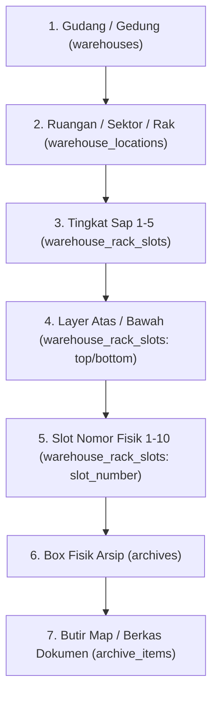

# LAPORAN AUDIT CODEBASE MENYELURUH (READ-ONLY)
**Aplikasi:** Document Management System (DMS) / Gudang Arsip PT Indraco (Laravel 7 Edition)  
**Branch:** `danu-revisi-3`  
**Path:** `c:\laragon\www\indraco-arsip-laravel-7`  
**Tanggal:** 05 Oktober 2026  
**Status:** Audit Read-Only & Analisis Kelaikan Sistem  

---

## 1. RINGKASAN EKSEKUTIF & ARSITEKTUR SISTEM

Sistem **Document Management System (DMS) PT Indraco (Laravel 7 Edition)** mengelola siklus hidup fisik dan digital dokumen/arsip perusahaan, meliputi registrasi draft box, booking lokasi rak gudang, penomoran box kustom otomatis, peminjaman dokumen, pengawasan masa retensi berkas, hingga alur pemusnahan dokumen (BAP).

### A. Hierarki Fisik Penyimpanan (Storage Physical Hierarchy)


### B. Dual Layout Interface Architecture
1. **Corporate Web Portal Layout** (`layouts/app.blade.php`): Ditujukan untuk peran `admin` dan `pic_gudang`.
2. **Desktop Workstation Edition (Delphi/VB MDI Style)** (`layouts/desktop_pic.blade.php`): Ditujukan untuk peran `pic_dept` dengan MDI tabbed window, Ribbon action bar, compact DBGrid spreadsheet, audio feedback, font-size scaling, dan integrasi shortcut keyboard (`F2`, `F5`, `F8`, `F9`, `Ctrl+F`).

---

## 2. METRIK AUDIT & STATISTIK GRAPHIFY

Berdasarkan analisis graf kode (AST & semantic relations) menggunakan engine **Graphify**:
- **Total Berkas Teranalisis:** 224 file (~243.221 kata)
- **Node Relasi:** 810 node
- **Edge Keterhubungan:** 1.232 edge
- **Komunitas Logika:** 170 komunitas
- **God Nodes (Komponen Sentral Sistem):**
  1. `Archive` (74 edge)
  2. `Department` (68 edge)
  3. `ActivityLogger` (58 edge)
  4. `WarehouseLocation` (47 edge)
  5. `SubDepartment` (27 edge)
  6. `BorrowingLog` (26 edge)
  7. `Warehouse` (25 edge)
  8. `DepartmentController` (16 edge)

---

## 3. DAFTAR TEMUAN AUDIT RINCI

### 🔴 Kategori P0: Critical (Keamanan, Otorisasi & Kegagalan Startup)

#### 1. Kerentanan Otorisasi Terbuka pada API Canvas Gudang (Broken Access Control)
- **File Terdampak:** 
  - [`routes/web.php` (Line 72-81)](file:///c:/laragon/www/indraco-arsip-laravel-7/routes/web.php#L72-L81)
  - [`app/Http/Controllers/WarehouseLayoutController.php` (Line 420-470)](file:///c:/laragon/www/indraco-arsip-laravel-7/app/Http/Controllers/WarehouseLayoutController.php#L420-L470)
- **Kondisi:** Endpoint mutasi layout gudang:
  - `POST /api/warehouse/locations/store`
  - `POST /api/warehouse/locations/{location}/delete`
  - `POST /api/warehouse/locations/{location}/update`
  - `POST /api/warehouse/locations/{location}/slots/assign`
  - `POST /api/warehouse/locations/{location}/slots/unassign`
- **Temuan:** Rute di atas berada di luar grup middleware `role:admin,pic_gudang`. Di sisi controller method (`destroyLocation`, `storeLocation`, dll.), **tidak terdapat validasi peran (`auth()->user()->role`)**.
- **Dampak:** Setiap user dengan hak akses paling rendah (`pic_dept`) dapat mengirimkan request HTTP POST untuk menghapus atau mengacak rak/ruangan gudang dari canvas layout.
- **Rekomendasi:** Pindahkan rute-rute mutasi layout ke dalam middleware `role:admin,pic_gudang` atau tambahkan policy check:
  ```php
  if (!auth()->user()->isPicGudang() && !auth()->user()->isSuperAdmin()) {
      abort(403, 'Akses ditolak.');
  }
  ```

#### 2. Ketiadaan Direktori `vendor/` & Blind Spot pada Launcher Desktop
- **File Terdampak:** 
  - [`START-DMS-INDRACO.bat`](file:///c:/laragon/www/indraco-arsip-laravel-7/START-DMS-INDRACO.bat)
  - [`artisan`](file:///c:/laragon/www/indraco-arsip-laravel-7/artisan#L20)
- **Kondisi:** Direktori `vendor/` belum ada (karena digitignore dan belum pernah menjalankan `composer install`).
- **Temuan:** Script auto-launcher `START-DMS-INDRACO.bat` memeriksa ketersediaan PHP, `.env`, dan `database.sqlite`, namun **lupa memeriksa ketersediaan `vendor/autoload.php`**. Ketika dieksekusi oleh pengguna akhir, script langsung menjalankan `php artisan` dan menghasilkan fatal error:
  `Fatal error: Failed opening required 'vendor/autoload.php'`.
- **Rekomendasi:** Tambahkan verifikasi `vendor/autoload.php` pada batch script dan berikan peringatan atau auto-run `composer install` jika composer tersedia di runtime.

---

### 🟠 Kategori P1: High (Integritas Data, Concurrency & Validitas Aset)

#### 3. Broken Image Asset (Logo Indraco 404 Not Found)
- **File Terdampak:** 
  - [`app/Providers/AppServiceProvider.php` (Line 30, 36)](file:///c:/laragon/www/indraco-arsip-laravel-7/app/Providers/AppServiceProvider.php#L30)
  - [`app/Http/Controllers/SettingController.php` (Line 18, 89, 104)](file:///c:/laragon/www/indraco-arsip-laravel-7/app/Http/Controllers/SettingController.php#L18)
  - [`database/migrations/2026_10_01_000002_create_app_settings_table.php` (Line 32)](file:///c:/laragon/www/indraco-arsip-laravel-7/database/migrations/2026_10_01_000002_create_app_settings_table.php#L32)
  - Layouts & Views (`layouts/app.blade.php`, `auth/login.blade.php`, `destructions/bap.blade.php`, `reports/print.blade.php`)
- **Kondisi:** Sistem mengacu pada file `images/logo-indraco.png` melalui helper `asset('images/logo-indraco.png')`.
- **Temuan:** Folder `public/images/` **tidak ada** dan masuk ke dalam [`.gitignore`](file:///c:/laragon/www/indraco-arsip-laravel-7/.gitignore). Berkas logo fisik resmi yang tersedia langsung di folder `public/` adalah [`public/logo-indraco-est.png`](file:///c:/laragon/www/indraco-arsip-laravel-7/public/logo-indraco-est.png).
- **Dampak:** Logo aplikasi pecah (HTTP 404) di header workstation, login screen, dan dokumen cetak BAP.
- **Rekomendasi:** Ubah default logo menjadi `logo-indraco-est.png` di `AppServiceProvider`, `SettingController`, dan template Blade.

#### 4. Inkonsistensi Slot pada Siklus Peminjaman & Pengembalian Dokumen
- **File Terdampak:** [`app/Http/Controllers/BorrowingController.php` (Line 236-250 & Line 277-290)](file:///c:/laragon/www/indraco-arsip-laravel-7/app/Http/Controllers/BorrowingController.php#L236-L290)
- **Kondisi:** Saat arsip berstatus *dispatched* (keluar gudang), slot rak dikosongkan (`status = empty`, `archive_id = null`), namun kolom `archives.warehouse_rack_slot_id` **tidak di-null-kan** dan tetap menunjuk ke ID slot tersebut.
- **Temuan:** Jika selama box dipinjam slot tersebut diisi oleh box lain, maka saat berkas dikembalikan (`returnArchive`), pengecekan `$slot->status === 'empty'` bernilai `false`. Akibatnya:
  - Box kembali berstatus `in_warehouse`.
  - Box tetap menunjuk ke `warehouse_rack_slot_id` yang sekarang ditempati oleh box lain.
  - Terjadi anomali dual-claim slot.
- **Rekomendasi:** Ketika status slot bentrok pada saat pengembalian, reset `warehouse_rack_slot_id = null` dan kirim notifikasi/alert ke PIC Gudang untuk melakukan realokasi slot rak baru.

#### 5. Race Condition pada Engine Generator Nomor Box Custom
- **File Terdampak:** [`app/Services/NumberingService.php` (Line 30-44)](file:///c:/laragon/www/indraco-arsip-laravel-7/app/Services/NumberingService.php#L30-L44)
- **Kondisi:** Pengambilan counter `$format->current_counter` dan `$format->increment('current_counter')` berjalan tanpa database transaction maupun row locking (`lockForUpdate()`).
- **Temuan:** Jika 2 box diverifikasi pada saat yang hampir bersamaan oleh PIC Gudang, generator dapat menghasilkan nomor box yang identik. Fallback format juga menggunakan `Archive::whereNotNull('box_number')->count() + 1` yang rawan duplikasi nomor jika ada data yang dihapus (*hard delete*).
- **Rekomendasi:** Bungkus operasi increment counter di dalam `DB::transaction()` dengan pessimistic locking `NumberingFormat::where('is_active', true)->lockForUpdate()->first()`.

---

### 🟡 Kategori P2: Medium (Arsitektur, Performa & Ketergantungan)

#### 6. Duplikasi Kode Masif pada Layout MDI Desktop (>4.200 Baris)
- **File Terdampak:** 
  - [`resources/views/layouts/app.blade.php`](file:///c:/laragon/www/indraco-arsip-laravel-7/resources/views/layouts/app.blade.php) (2.179 baris)
  - [`resources/views/layouts/desktop_pic.blade.php`](file:///c:/laragon/www/indraco-arsip-laravel-7/resources/views/layouts/desktop_pic.blade.php) (2.115 baris)
- **Temuan:** Kedua layout memiliki 95% kode yang identik (Alpine.js window manager, live font scaling sync, styling tabel DBGrid, Ribbon action bar, status bar footer, dan audio click synthesizer). Perbedaan satu-satunya adalah menu navigasi sidebar/ribbon yang ditampilkan untuk role `pic_dept`.
- **Dampak:** Setiap penambahan fitur (seperti implementasi tombol Setting di footer pada Revisi 2) harus diduplikasi manual di kedua file, meningkatkan risiko inkonsistensi (*code drift*).
- **Rekomendasi:** Gabungkan kedua berkas menjadi satu master layout dan pisahkan menu navigasi menjadi partial Blade terpisah berdasarkan role (`@if(auth()->user()->isPicDept()) ... @endif`).

#### 7. Ketergantungan Eksternal CDN untuk Aplikasi Desktop Offline/Intranet
- **File Terdampak:** Header [`layouts/app.blade.php`](file:///c:/laragon/www/indraco-arsip-laravel-7/resources/views/layouts/app.blade.php#L28-L43) & [`layouts/desktop_pic.blade.php`](file:///c:/laragon/www/indraco-arsip-laravel-7/resources/views/layouts/desktop_pic.blade.php#L28-L43)
- **Temuan:** Tailwind CSS (`cdn.tailwindcss.com`), Alpine.js (`cdn.jsdelivr.net`), dan Lucide Icons (`unpkg.com`) dimuat via link CDN internet publik.
- **Dampak:** Jika komputer di gudang arsip atau kantor beroperasi di jaringan tertutup (intranet lokal / LAN tanpa koneksi internet luar), **seluruh UI, modal dialog, tab MDI, dan styling aplikasi tidak akan dapat dimuat**.
- **Rekomendasi:** Simpan asset bundle Tailwind, Alpine.js, dan Lucide Icons secara lokal di direktori `public/vendor/` atau `public/js/` & `public/css/`.

#### 8. Database Query Overhead pada `View::composer('*')`
- **File Terdampak:** [`app/Providers/AppServiceProvider.php` (Line 29-50)](file:///c:/laragon/www/indraco-arsip-laravel-7/app/Providers/AppServiceProvider.php#L29-L50)
- **Temuan:** `View::composer('*')` terpanggil pada **setiap** view, sub-view, dan component yang dirender di Blade. Di dalamnya dijalankan query `Schema::hasTable('app_settings')` dan 3 kali pemanggilan `AppSetting::get()`. Untuk 1 request halaman yang merender 4 sub-view, terjadi belasan query database redundant tanpa caching.
- **Rekomendasi:** Cache hasil setting dalam static property atau request-level cache (`static $cachedSettings = null;`).

#### 9. Mutasi State Database pada HTTP GET Request
- **File Terdampak:** [`app/Http/Controllers/WarehouseLayoutController.php` (Line 48-53)](file:///c:/laragon/www/indraco-arsip-laravel-7/app/Http/Controllers/WarehouseLayoutController.php#L48-L53)
- **Temuan:** Pada API endpoint `GET /api/warehouse/layout-data`, terdapat logika:
  ```php
  if ($loc->location_type === 'rack' && $loc->slots->count() === 0) {
      $loc->generateStandardSlots(); // Menulis 100 baris ke database pada GET request!
  }
  ```
- **Dampak:** Operasi read (GET) menimbulkan beban penulisan database (100 insert per rak) dan memperlambat load denah canvas.
- **Rekomendasi:** Pindahkan slot generation ke event create master rak (`WarehouseController@storeLocation`) atau database seeder.

---

### 🟢 Kategori P3: Low (Hygiene, Dead Code & Testing)

#### 10. File Sisa / Orphan Views dari Project Lain (Website Profil / E-commerce)
- **File Terdampak:**
  - Direktori [`resources/views/admin/`](file:///c:/laragon/www/indraco-arsip-laravel-7/resources/views/admin) (13 subfolder: *produk, variant, merek, kategori, banner, download, kontak, dll.*)
  - Direktori [`resources/views/pages/`](file:///c:/laragon/www/indraco-arsip-laravel-7/resources/views/pages) (*store, products, careers, businesses, about, contact, dll.*)
  - Middleware tak terpakai: [`app/Http/Middleware/TrackPageVisits.php`](file:///c:/laragon/www/indraco-arsip-laravel-7/app/Http/Middleware/TrackPageVisits.php) yang mengacu pada model non-existent `MasterLogKunjungan`.
- **Temuan:** Berkas-berkas ini adalah sisa boilerplate dari template proyek company profile PT Indraco yang tidak memiliki rute, controller, maupun model pada DMS Arsip.
- **Rekomendasi:** Hapus folder orphan tersebut untuk menjaga kebersihan dan kecepatan build/indexing codebase.

#### 11. Skrip Debug Sementara di Root Folder
- **File Terdampak:**
  - [`test_r7.php`](file:///c:/laragon/www/indraco-arsip-laravel-7/test_r7.php) (memiliki baris `unlink(__FILE__)`)
  - [`scratch_check_colors.php`](file:///c:/laragon/www/indraco-arsip-laravel-7/scratch_check_colors.php)
  - [`scratch_check_locations.php`](file:///c:/laragon/www/indraco-arsip-laravel-7/scratch_check_locations.php)
  - File asset mentah di root: `layout rak.png`, `layout_gudang.png`, `nomor_rak.png`, `layout HURUF rak  Gudang dokumen (g.k 678).pdf`.
- **Rekomendasi:** Pindahkan ke direktori [`scratch/`](file:///c:/laragon/www/indraco-arsip-laravel-7/scratch) atau hapus dari root repository.

#### 12. Duplikasi Definisi Rute pada `routes/web.php`
- **File Terdampak:** [`routes/web.php`](file:///c:/laragon/www/indraco-arsip-laravel-7/routes/web.php) baris 27-28 dan baris 84-85:
  ```php
  Route::get('/api/departments/{department}/archives', 'DepartmentController@apiGetDepartmentArchives')->name('api.departments.archives');
  Route::get('/api/sub-departments/{subDepartment}/archives', 'DepartmentController@apiGetSubDepartmentArchives')->name('api.sub_departments.archives');
  ```
- **Rekomendasi:** Hapus salah satu blok rute duplikat tersebut.

#### 13. Omission pada Database Seeder (Empty Archive Items)
- **File Terdampak:** [`database/seeds/DatabaseSeeder.php`](file:///c:/laragon/www/indraco-arsip-laravel-7/database/seeds/DatabaseSeeder.php)
- **Temuan:** `DatabaseSeeder.php` menginisialisasi 5 box arsip contoh, namun tidak pernah memanggil [`SyncArchiveItemsSeeder`](file:///c:/laragon/www/indraco-arsip-laravel-7/database/seeds/SyncArchiveItemsSeeder.php). Akibatnya, box arsip contoh default memiliki daftar butir dokumen kosong saat pertama kali diuji.
- **Rekomendasi:** Tambahkan `$this->call(SyncArchiveItemsSeeder::class);` di baris akhir `DatabaseSeeder.php`.

#### 14. Isolasi Database Testing pada `phpunit.xml`
- **File Terdampak:** [`phpunit.xml` (Line 24-25)](file:///c:/laragon/www/indraco-arsip-laravel-7/phpunit.xml#L24-L25)
- **Temuan:** Konfigurasi sqlite `:memory:` di-comment out:
  ```xml
  <!-- <server name="DB_CONNECTION" value="sqlite"/> -->
  <!-- <server name="DB_DATABASE" value=":memory:"/> -->
  ```
  Menjalankan test tanpa mengaktifkan konfigurasi ini berisiko memanipulasi database development lokal.
- **Rekomendasi:** Aktifkan kembali opsi sqlite in-memory untuk testing.

---

## 4. PRIORITAS RENCANA TINDAKAN (ACTION MATRIX)

| Prioritas | Poin | Deskripsi Tindakan | Estimasi Dampak |
| :---: | :---: | :--- | :--- |
| **P0** | 1 | Proteksi rute & controller API mutasi canvas gudang dengan `role:admin,pic_gudang`. | Menutup celah keamanan kritis otorisasi. |
| **P0** | 2 | Tambahkan pengecekan `vendor/autoload.php` pada `START-DMS-INDRACO.bat`. | Mencegah crash fatal saat launching aplikasi. |
| **P1** | 3 | Ganti default path logo ke `logo-indraco-est.png` di seluruh controller, provider, dan view. | Memperbaiki broken image 404 pada UI & dokumen resmi. |
| **P1** | 4 | Tambahkan handling slot collision saat box pinjaman dikembalikan ke gudang. | Menjamin integritas pemetaan slot rak fisik. |
| **P1** | 5 | Terapkan `lockForUpdate()` dan DB Transaction pada `NumberingService`. | Mencegah duplikasi nomor box kustom saat approval paralel. |
| **P2** | 6 | Unduh asset Tailwind, Alpine.js, dan Lucide Icons ke local storage `public/`. | Aplikasi 100% siap dijalankan pada workstation intranet offline. |
| **P2** | 7 | Refactor layout `app.blade.php` dan `desktop_pic.blade.php` menjadi 1 core layout. | Menghilangkan >2.000 baris duplikasi kode antarmuka. |
| **P2** | 8 | Cache pemanggilan `AppSetting` pada request lifecycle di `AppServiceProvider`. | Menghilangkan query overhead pada rendering view. |
| **P3** | 9 | Hapus folder orphan `views/admin/` dan `views/pages/`, serta bersihkan file scratch di root. | Codebase bersih, rapi, dan berfokus pada fitur DMS. |
| **P3** | 10 | Aktifkan `SyncArchiveItemsSeeder` pada `DatabaseSeeder.php` dan perbaiki `phpunit.xml`. | Seeder data lengkap dan pengujian otomatis terisolasi. |

---
*Laporan ini disimpan pada berkas `audit_codebase_revisi_3.md` di branch `danu-revisi-3`.*
