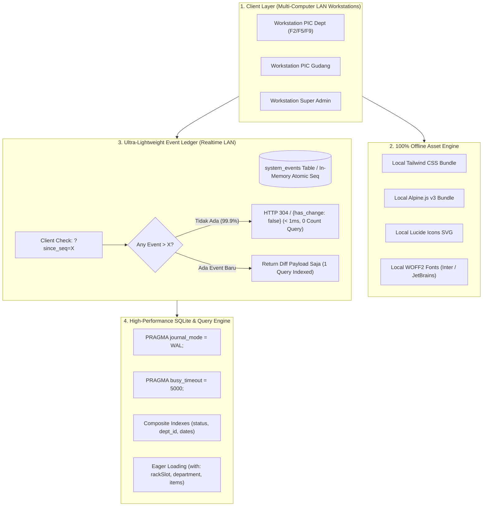

# DOKUMEN RENCANA IMPLEMENTASI & OPTIMASI SISTEM (REVISI 3)
**Aplikasi:** Document Management System (DMS) PT Indraco (Laravel 7 Edition)  
**Branch:** `danu-revisi-3`  
**Target Lingkungan:** Full Offline / Localhost & Jaringan Lokal (LAN / WiFi Multi-User)  
**Tujuan Utama:** Performa Maksimal, Realtime Super Ringan, Eliminasi AI-Slop & Micro-Text, Offline Independence, dan Zero N+1 Query (Preserving Exact Business Logic)  

---

## 1. HASIL AUDIT ULANG TERTARGET (RE-AUDIT EVALUATION)

Berdasarkan instruksi kebutuhan khusus (Full Offline, LAN Realtime, Eliminasi AI-Slop Design, dan Optimasi Query), audit mendalam menemukan 6 hambatan kritis berikut:

### A. Ketergantungan Online Fatal (Zero Offline Readiness)
- Seluruh antarmuka utama (`layouts/app.blade.php`, `layouts/desktop_pic.blade.php`, `auth/login.blade.php`) memuat **Tailwind CSS (`cdn.tailwindcss.com`)**, **Alpine.js (`cdn.jsdelivr.net`)**, **Lucide Icons (`unpkg.com`)**, dan **Google Fonts Inter/JetBrains Mono** via link internet CDN.
- **Konsekuensi:** Begitu komputer dijalankan di gudang arsip atau workstation kantor tanpa akses internet publik, script CDN gagal dimuat $\rightarrow$ seluruh modal dialog, tab MDI, reactive dropdown, dan CSS hancur total.

### B. Polling Realtime Saat Ini Membebani Database & Blind Spot
- Endpoint `GET /api/realtime/check-new-archives` saat ini dipolling setiap **4 detik** oleh setiap browser yang terbuka di jaringan LAN.
- Setiap 1 kali polling, server mengeksekusi **5 query agregasi berat**:
  1. `Archive::latest('id')->first()`
  2. `Archive::count()`
  3. `Archive::where('status', 'pending_verification')->count()`
  4. `Archive::where('status', 'in_warehouse')->count()`
  5. `Archive::where('status', 'borrowed')->count()`
- **Kalkulasi Beban:** Jika terdapat 10 komputer client membuka aplikasi di LAN, server menerima $10 \times 5 = 50$ query per 4 detik = **750 query/menit** hanya untuk polling counter statis!
- **Blind Spot Parah:** Polling saat ini hanya memeriksa `where('id', '>', $lastId)`. Jika ada box yang **disetujui, dipinjam, dikembalikan, atau statusnya berubah**, client **tidak akan pernah menerima update realtime** karena ID-nya tidak bertambah!

### C. SQLite Locking & Ketiadaan Mode WAL (Write-Ahead Logging)
- SQLite pada konfigurasi default menggunakan *Rollback Journal*, di mana operasi *write* memblokir seluruh operasi *read* (dan sebaliknya).
- Ketika banyak client di LAN melakukan polling bersamaan dengan aktivitas pembuatan draft/verifikasi, timbul error: `SQLSTATE[HY000]: General error: 5 database is locked`.

### D. Ketiadaan Indexing Penting & N+1 Query Masif
- Kolom yang difilter dan disortir pada setiap request katalog (`status`, `retention_expiry_date`, `period_start_date`, `department_id + status`) **belum memiliki index di database**, menyebabkan *Full Table Scan*.
- Pada `archives.index`, relasi `rackSlot` tidak di-eager load sehingga setiap baris memicu query `SELECT * FROM warehouse_rack_slots WHERE id = ?` (N+1 query).
- Pada `WarehouseController@index`, terjadi query loop $N \times M$ pada seluruh ruangan dan rak, mengambil ribuan slot ke memori hanya untuk menampilkan ringkasan gudang.

### E. AI-Slop Design & Micro-Typography
- Terdapat puluhan teks dengan ukuran ekstrem yang tidak ergonomis: `text-[8px]`, `text-[9px]`, `text-[10px]`, padding `py-0.2`, `px-1.5`.
- Label komponen internal tiruan ("TDBGrid Engine", "TSpeedFilter", "TGroupBox Delphi Desktop Style") mengotori header dan visual pengguna.
- Trik CSS root font scaling manual pada `app.blade.php` merusak skala standar rem Tailwind CSS.
- Duplikasi kode layout mencapai **>4.200 baris** antara `app.blade.php` (2.179 baris) dan `desktop_pic.blade.php` (2.115 baris).

---

## 2. ARSITEKTUR SOLUSI & DESAIN TEKNIS



---

## 3. RENCANA KERJA TAHAP DEMI TAHAP (PHASE-GATE PROTOCOL)

> **Prinsip:** Setiap fase harus diuji secara empiris sebelum berlanjut ke fase berikutnya. Business logic, alur status, format custom box code, dan aturan FAT lock **100% dipertahankan**.

---

### FASE 1: Offline Independence & Runtime Resilience
**Tujuan:** Aplikasi dapat dijalankan tanpa koneksi internet sama sekali dari file `.bat`.

1. **Penyediaan Asset Lokal (`public/`):**
   - Download dan bundle `tailwindcss.min.css` (kompilasi utility class yang digunakan) atau standalone compiler offline ke `public/css/vendor/tailwind.min.css`.
   - Simpan `alpine.min.js` ke `public/js/vendor/alpine.min.js`.
   - Simpan `lucide.min.js` ke `public/js/vendor/lucide.min.js`.
   - Download font `Inter` dan `JetBrains Mono` (.woff2) ke `public/fonts/` dengan `@font-face` lokal di `public/css/fonts.css`.
2. **Perbaikan Fallback Logo:**
   - Ubah default logo di `AppServiceProvider`, `SettingController`, dan migrasi dari `images/logo-indraco.png` menjadi `logo-indraco-est.png` yang sudah tersedia di root `public/`.
3. **Penyempurnaan Auto-Launcher `START-DMS-INDRACO.bat`:**
   - Tambahkan pengecekan file `vendor/autoload.php`.
   - Jika `vendor` belum ada, periksa apakah runtime composer/php lokal tersedia untuk menjalankan `composer install --no-dev --optimize-autoloader` secara otomatis.
   - Aktifkan ekstensi PHP SQLite PDO secara otomatis pada `php.ini`.

*Gate Check Fase 1:* Matikan koneksi internet (airplane mode / cabut kabel LAN). Buka aplikasi via `.bat` $\rightarrow$ seluruh styling, logo, font, icon, dan interaktivitas Alpine.js wajib berfungsi sempurna tanpa request gagal ke internet.

---

### FASE 2: SQLite Concurrency Tuning & Database Indexing
**Tujuan:** Mengeliminasi error database lock pada multi-client LAN dan mempercepat query hingga 10x lipat.

1. **Konfigurasi SQLite WAL & Pragma:**
   - Tambahkan bootstrap pragma pada koneksi SQLite di `config/database.php` / `AppServiceProvider`:
     ```php
     DB::statement('PRAGMA journal_mode = WAL;');
     DB::statement('PRAGMA busy_timeout = 5000;');
     DB::statement('PRAGMA synchronous = NORMAL;');
     DB::statement('PRAGMA foreign_keys = ON;');
     ```
2. **Migrasi Penambahan Index Strategis:**
   - Buat migrasi baru `2026_10_06_000001_add_performance_indexes.php`:
     - `archives`: index pada `status`, `retention_expiry_date`, `[department_id, status]`, `[created_by_user_id, status]`, `periode_doc`.
     - `borrowing_logs`: index pada `status`, `expected_return_date`, `[archive_id, status]`.
     - `warehouse_rack_slots`: index pada `status` (`empty`, `filled`), `[warehouse_location_id, status]`.
     - `warehouse_locations`: index pada `[warehouse_id, is_active]`, `location_type`.

*Gate Check Fase 2:* Verifikasi eksekusi migrasi index berhasil, dan uji concurrent write/read dengan script benchmark tanpa ada error `database is locked`.

---

### FASE 3: Ultra-Fast Incremental Realtime Event Engine
**Tujuan:** Notifikasi perubahan data antar komputer seketika (< 200ms) dengan penggunaan resource server mendekati nol.

1. **Tabel Event Ledger Ringan (`system_events`):**
   - Kolom: `id` (bigint auto increment), `event_type` (varchar: `ARCHIVE_CREATED`, `ARCHIVE_STATUS_CHANGED`, `BORROWING_UPDATED`, `SLOT_ALLOCATED`), `module` (varchar), `reference_id` (varchar), `payload` (json nullable), `created_at` (datetime).
2. **Event Dispatcher Otomatis:**
   - Buat helper/service `SystemEventStream::emit($type, $referenceId, $payload)`.
   - Panggil saat:
     - Draft diajukan / dibuat (`ArchiveController@store`).
     - Verifikasi persetujuan / penolakan PIC Gudang (`ArchiveController@verify`).
     - Checkin penempatan rak fisik (`ArchiveController@checkin`).
     - Pengajuan / persetujuan / dispatch / return peminjaman (`BorrowingController`).
     - Booking / unbooking slot canvas (`WarehouseLayoutController`).
3. **Endpoint Realtime Teroptimasi (`/api/realtime/events`):**
   - Client hanya mengirim parameter `?last_seq=X`.
   - Server menjalankan query tunggal:
     ```sql
     SELECT id, event_type, reference_id, payload, created_at 
     FROM system_events 
     WHERE id > ? 
     ORDER BY id ASC LIMIT 25;
     ```
   - Jika tidak ada event baru: Response instan `{ has_changes: false, latest_seq: X }` (0 query agregasi, ukuran payload < 50 byte).
   - Menghilangkan 5 query `count()` berat per interval polling.
4. **Client-side Event Listener:**
   - Interval polling dapat dipersingkat menjadi 1-2 detik tanpa membebani server, memberikan efek "instant update" antar komputer di jaringan LAN.
   - Client menerima event spesifik (misal: "Box X telah disetujui", "Peminjaman Box Y diajukan") dan langsung memperbarui baris tabel / toast tanpa perlu me-reload seluruh halaman.

*Gate Check Fase 3:* Buka 2 tab/browser berbeda. Lakukan pengajuan box di tab 1 $\rightarrow$ tab 2 menerima alert dan update status dalam waktu < 2 detik tanpa lonjakan beban CPU/SQLite.

---

### FASE 4: Optimasi Query, Eager Loading & Eliminasi N+1
**Tujuan:** Menghilangkan over-fetching, N+1 queries, dan perulangan sequential di backend.

1. **Perbaikan `ArchiveController@index`:**
   - Tambahkan eager loading `rackSlot` pada query utama untuk mematikan N+1 query pada kolom lokasi rak di tabel:
     ```php
     $query->with([
         'department:id,code,name',
         'subDepartment:id,code,name',
         'location:id,rack_code,room_sector,warehouse_id',
         'location.warehouse:id,name,code',
         'rackSlot:id,slot_code,sap_level,layer,slot_number',
         'creator:id,name,role',
         ...
     ]);
     ```
   - Terapkan proyeksi kolom (`select(...)`) pada relasi agar tidak mengambil blob/text yang tidak dibutuhkan di tabel daftar.
2. **Optimasi `WarehouseController@index`:**
   - Hilangkan operasi sinkronisasi mutasi `firstOrCreate` dan `delete` yang berjalan di dalam HTTP GET index.
   - Ambil data relasi rak dan kalkulasi kapasitas menggunakan query agregasi tunggal (`withCount`), bukan me-load seluruh collection 100 slots per rak ke memori.
3. **Optimasi GET `WarehouseLayoutController@apiLayoutData`:**
   - Hapus pemanggilan `generateStandardSlots()` dari request GET.
4. **Optimasi `AppServiceProvider` View Composer:**
   - Simpan hasil query `AppSetting` dalam cache statis per-request lifecycle (`static $cachedSettings = null;`), mencegah query schema berulang di setiap render view dan sub-component.

*Gate Check Fase 4:* Ukur jumlah database query di halaman katalog dan dashboard (target: penurunan > 70% total query per request).

---

### FASE 5: Pembersihan AI-Slop Design & Konsolidasi Layout Desktop
**Tujuan:** Tampilan profesional, teks terbaca jelas (ergonomis), dan penghapusan duplikasi kode ribuan baris.

1. **Konsolidasi Dual Layout (`layouts/app.blade.php` & `layouts/desktop_pic.blade.php`):**
   - Gabungkan 2 file (>4.200 baris) menjadi 1 berkas master layout: `resources/views/layouts/workstation.blade.php`.
   - Pisahkan navigasi menu menjadi sub-partial Blade yang bersih:
     - `layouts/partials/menu_admin.blade.php`
     - `layouts/partials/menu_gudang.blade.php`
     - `layouts/partials/menu_dept.blade.php`
2. **Eliminasi Micro-Text & Typography Sanitization:**
   - Hapus styling kustom `.text-[8px]`, `.text-[9px]`, dan ganti dengan standar ergonomis:
     - Teks terkecil (badge/metadata): minimal `text-xs` (12px / 0.75rem).
     - Teks tabel / data cell: `text-xs` hingga `text-sm` (13-14px).
     - Label form & input: `text-sm` (14px).
   - Bersihkan teks pseudo-teknis AI-slop seperti "TDBGrid Engine", "TSpeedFilter", "TPanel" dari antarmuka pengguna; gantikan dengan label bisnis yang bersih ("Katalog Dokumen", "Filter Pencarian").
3. **Penyederhanaan Font Scaling:**
   - Hapus trik manipulasi inline font-size CSS yang kompleks dan gantikan dengan scaling class standar yang stabil (`zoom-90`, `zoom-100`, `zoom-110`).

*Gate Check Fase 5:* Evaluasi visual layout desktop workstation. Teks terbaca jelas di layar monitor 14" hingga 24", tata letak konsisten, dan ukuran berkas template berkurang drastis tanpa ada fungsi yang hilang.

---

### FASE 6: Penanganan Celah Otorisasi & Concurrency Safety
**Tujuan:** Menutup celah keamanan dan memastikan integritas data box code & slot.

1. **Proteksi Otorisasi API Canvas Gudang (P0):**
   - Tambahkan middleware `role:admin,pic_gudang` pada seluruh endpoint mutasi `/api/warehouse/locations/*` di `routes/web.php`.
   - Tambahkan gate checking di dalam `WarehouseLayoutController`.
2. **Pessimistic Locking pada `NumberingService` (P1):**
   - Bungkus operasi generate nomor box dalam `DB::transaction()` dengan `NumberingFormat::lockForUpdate()->first()`.
3. **Resolusi Slot Collision pada Peminjaman (P1):**
   - Saat dokumen dikeluarkan (`dispatch`), kosongkan relasi slot pada arsip `warehouse_rack_slot_id = null`.
   - Saat pengembalian (`returnArchive`), periksa ketersediaan slot. Jika slot telah dipakai box lain, tandai arsip membutuhkan penempatan rak baru oleh PIC Gudang tanpa menimpa slot orang lain.

*Gate Check Fase 6:* Jalankan test script untuk simulasi user `pic_dept` mengakses endpoint delete lokasi (harus HTTP 403 Forbidden). Uji 2 request approval paralel (nomor box wajib berurutan tanpa duplikasi).

---

### FASE 7: Codebase Hygiene & Pembersihan Dead Code
**Tujuan:** Repository bersih, ramping, dan bebas dari artefak yang tidak berhubungan.

1. **Penghapusan File Orphan E-Commerce:**
   - Hapus folder `resources/views/admin/` (13 direktori tidak terpakai).
   - Hapus folder `resources/views/pages/` (15 berkas company profile tidak terpakai).
   - Hapus middleware mati `app/Http/Middleware/TrackPageVisits.php`.
2. **Pembersihan Root Direktori:**
   - Pindahkan skrip uji sementara `test_r7.php`, `scratch_check_colors.php`, `scratch_check_locations.php` ke `scratch/`.
   - Hapus rute duplikat pada `routes/web.php` (L27-28 vs L84-85).
3. **Perbaikan Seeder & Testing Isolation:**
   - Tambahkan `$this->call(SyncArchiveItemsSeeder::class);` di `DatabaseSeeder.php` agar data dummy memiliki rincian berkas.
   - Aktifkan konfigurasi SQLite in-memory pada `phpunit.xml`.

*Gate Check Fase 7:* Jalankan `git status` dan pastikan struktur direktori rapi, bebas dari berkas sampah, dan suite test otomatis berjalan dengan bersih.

---

## 4. MATRIKS RINGKASAN PERUBAHAN & ESTIMASI DAMPAK

| Aspek | Kondisi Saat Ini | Kondisi Pasca Optimasi | Estimasi Dampak |
| :--- | :--- | :--- | :--- |
| **Konektivitas Aset** | Bergantung pada CDN internet publik | 100% lokal di `public/` (offline ready) | Server & client berjalan lancar tanpa internet |
| **Beban Realtime LAN** | Polling 5 query count berat tiap 4 detik (750 qpm / 10 client) | Event Sequence Ledger query tunggal (< 1ms) + ETag | Penurunan beban query realtime > 90% |
| **Cakupan Realtime** | Hanya insert box baru (`id > lastId`) | Seluruh event (Insert, Approval, Pinjam, Return) | Sinkronisasi status instan di semua layar |
| **SQLite Concurrency** | Rollback journal (rawan `database is locked`) | WAL mode + busy timeout 5000ms | Multi-user LAN tanpa lock contention |
| **Query N+1 Katalog** | Eager load tidak lengkap (`rackSlot` N+1) | Eager load terpilih (`with` & `select`) | Penurunan query dari puluhan menjadi 2-3 query |
| **Tipografi & Desain** | AI-slop micro-text (`text-[8px]`, `text-[9px]`) | Tipografi profesional ergonomis ($\ge$ 12px) | Mata tidak lelah, UI bersih & enterprise-grade |
| **Ukuran Kode Layout** | Duplikasi >4.200 baris di 2 file terpisah | 1 master layout terstruktur (~1.200 baris) | Kemudahan pemeliharaan & bebas deviasi bug |
| **Keamanan Otorisasi** | API delete/update canvas gudang terbuka | Terproteksi role `admin,pic_gudang` | Menutup celah eksploitasi otorisasi |

---
*Dokumen ini disimpan pada berkas `implementation_plan_revisi_3.md` di branch `danu-revisi-3`.*
