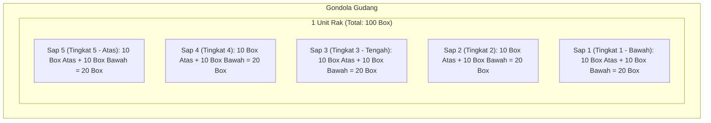

# DOKUMEN REVISI FITUR SISTEM ARSIP DIGITAL (REVISI 1)
**Project:** Indraco Arsip (Laravel 7)  
**Path:** `C:\laragon\www\#Project2026\indraco-arsip-laravel-7`  
**Tanggal:** 21 September 2026  
**Status Dokumen:** Rencana Kerja & Spesifikasi Implementasi Fitur

---

## 1. DAFTAR SPESIFIKASI KEBUTUHAN PER ROLE USER

### A. ADMIN USER (`admin` / Webdev)
1. **Standarisasi Ukuran & Kapasitas Rak (Box "TB 30g"):**
   - Ukuran box standar gudang: **"TB 30g"**.
   - Struktur Rak:
     - 1 Rak terdiri dari **5 sap (tingkat/baris) ke atas**.
     - 1 Sap baris berisi **20 kardus** (**10 kardus baris bawah** dan **10 kardus baris atas**).
     - Total kapasitas dalam 1 Rak = **5 sap × 20 box = 100 kotak kardus**.
2. **Labeling Box & Metadata Dokumen:**
   - Terdapat **Tanggal Periode Dokumen** dan **Tanggal Penyerahan Dokumen** pada label box.
3. **Aturan 1 Box 1 Periode:**
   - 1 box hanya berisi **satu periode dokumen**, tidak boleh dicampur antar-periode.
4. **Kalkulasi Masa Simpan:**
   - Masa simpan diambil dan dihitung secara otomatis dari tanggal periode dokumen.
5. **Format Tanggal Periode:**
   - Format periode dokumen menggunakan **YYYY/MM** (contoh: `2026/09`).
6. **Shortcut Dashboard Admin:**
   - Tersedia tombol shortcut di Dashboard Admin yang posisinya **di bawah kolom pencarian (*search bar*)**, langsung mengarah ke modul **Input Gudang Layout** (sinkron dengan PIC Gudang).
7. **Integrasi Data Master Departemen:**
   - Penamaan dan ID Departemen diambil / disinkronkan dari data **SIDAR**.
8. **Master Sub-Departemen:**
   - Master data Departemen ditambahkan relasi data **Sub-Departemen**.
9. **Custom Masa Simpan per Departemen:**
   - Masa simpan dapat dikonfigurasi/di-custom secara fleksibel untuk masing-masing departemen.
10. **Visualisasi Interaktif Layout 2D Rak:**
    - Pada menu Layout 2D Gudang, saat sebuah rak diklik, akan muncul visualisasi detail rak **5 sap baris**, dengan masing-masing sap menampilkan **10 baris kardus bawah dan 10 baris kardus atas** (total visualisasi **100 kotak kardus**).
11. **Hak Kontrol Sistem:**
    - Pengendalian, administrasi sistem, dan konfigurasi berada di bawah **Webdev / Superadmin**.

---

### B. DEPARTEMEN USER (`pic_dept` / User Departemen)
1. **Custom Nama Dokumen:**
   - Menambahkan opsi input pilihan **custom nama dokumen** bagi user departemen jika nama dokumen belum terdaftar di master data.
2. **Format Cetak Label Box A5 (Draft/Pra-Gudang):**
   - Fitur generate & print label box form ukuran **A5**.
   - Bagian **Nomor Rak & Nomor Gudang dikosongkan** (akan diisi oleh PIC Gudang).
3. **Manajemen & Pencarian Dokumen:**
   - Input, pencarian, dan pengisian rincian dokumen di dalam gudang arsip.

---

### C. GUDANG USER (`pic_gudang` / PIC Gudang)
1. **Penyelesaian Label Box A5:**
   - Menerima cetak label A5 dari departemen dan melengkapi **Nomor Gudang & Nomor Rak**.
2. **Format Layout Box & Rak Paten:**
   - Struktur tata letak box dan rak bersifat baku/paten mengikuti spesifikasi fisik gudang.
3. **Hierarki Penataan Gudang:**
   - 1 Gondola terdiri dari beberapa Rak; 1 Rak terdiri dari 5 sap tingkat.
4. **Indikator Warna Status Box pada Denah Layout:**
   - 🔴 **Merah** : Box Expired (masa simpan dokumen telah habis).
   - 🟡 **Kuning** : Box Terisi (slot terisi box dokumen aktif).
   - 🟢 **Hijau** : Slot Kosong (tersedia untuk dialokasikan box baru).
5. **Ploting Tetap (Fixed Grid):**
   - Ploting baris rak sudah fixed/terkunci (pengisian box pada masing-masing baris tersusun rapi sesuai grid slot).
6. **Akses Menu Layout 2D:**
   - Fitur visualisasi Layout Gudang 2D dapat diakses penuh oleh PIC Gudang untuk kebutuhan operasional alokasi fisik.

---

## 2. ATURAN BISNIS (BUSINESS RULES)

1. **Alur Transaksi Peminjaman / Pengeluaran Barang (Pinjam) & Pemusnahan:**
   - Wajib unggah dokumen persetujuan (*upload file approval*).
   - **Kondisi Tombol:** Tombol aksi `Simpan`, `Ajukan Pinjam`, atau `Pemusnahan` **hanya akan muncul/aktif** apabila berkas approval sudah terunggah lengkap.
2. **Proteksi & Penguncian Ruangan (Room Locking):**
   - **2 Ruangan Khusus di-lock eksklusif untuk departemen FAT** (Finance, Accounting, & Tax).
   - Ruangan lainnya bersifat **keroyokan / shared** yang dapat digunakan oleh seluruh departemen.
3. **Pencarian Cerdas & Auto-Suggestion:**
   - Kata kunci pencarian dan rekomendasi (*search suggestion*) merujuk pada teks metadata dan rincian isi yang tertera pada label dokumen.
4. **Ukuran Font Dinamis (Auto Font-Scaling):**
   - Tipografi teks rincian isi dokumen pada cetakan label A5 bersifat dinamis (mengecil otomatis jika baris teks banyak) agar proporsional dan tidak terpotong pada batas kertas A5.

---

## 3. FORMAT DAN STRUKTUR CETAK LABEL BOX (FORM A5)

Tampilan cetak label box berukuran **A5** memiliki format standar berikut:

```text
+-----------------------------------------------------------------------+
|  LOGO INDRACO                                            LABEL BOX    |
|  SISTEM ARSIP DIGITAL                                   UKURAN TB 30g |
+-------------------------------------------------+---------------------+
| Dept            : [Nama Dept / Sub-Dept]        |                     |
| Tgl. Penyerahan : [DD/MM/YYYY]                  |    NOMOR GUDANG     |
| Periode Dokumen : [YYYY/MM]                     |     [ G-01 ]        |
| Masa Simpan     : [X Tahun / Custom] (s/d YYYY) |                     |
|-------------------------------------------------+---------------------|
| Isi Dokumen :                                   |     NOMOR RAK       |
|   - [Rincian Berkas Dokumen 1]                  |     [ RAK-A3 ]      |
|   - [Rincian Berkas Dokumen 2]                  |  (Sap 2, Slot B-04) |
|   - [Rincian Berkas Dokumen 3]                  |                     |
|   - [Rincian Berkas Dokumen 4]                  |                     |
|   - [Rincian Berkas Dokumen 5]                  |                     |
|   ... (Font ukuran dinamis menyesuaikan isi)    |                     |
+-------------------------------------------------+---------------------+
```

> **Catatan Label:**  
> - Ketika dicetak oleh **User Departemen**: Kolom Nomor Gudang & Nomor Rak **kosong**.  
> - Setelah diverifikasi & dialokasikan oleh **PIC Gudang**: Kolom Nomor Gudang & Nomor Rak terisi lengkap.

---

## 4. SPESIFIKASI TEKNIS & ARSITEKTUR LAYOUT RAK 2D (100 BOX PER RAK)



### Detail Grid Per Sap:
| Sap / Baris | Layer | Slot 1 | Slot 2 | Slot 3 | Slot 4 | Slot 5 | Slot 6 | Slot 7 | Slot 8 | Slot 9 | Slot 10 | Subtotal |
|:---|:---:|:---:|:---:|:---:|:---:|:---:|:---:|:---:|:---:|:---:|:---:|:---:|
| **Sap 5** | Atas | 🟩/🟨/🟥 | 🟩/🟨/🟥 | 🟩/🟨/🟥 | 🟩/🟨/🟥 | 🟩/🟨/🟥 | 🟩/🟨/🟥 | 🟩/🟨/🟥 | 🟩/🟨/🟥 | 🟩/🟨/🟥 | 🟩/🟨/🟥 | 10 Box |
| | Bawah | 🟩/🟨/🟥 | 🟩/🟨/🟥 | 🟩/🟨/🟥 | 🟩/🟨/🟥 | 🟩/🟨/🟥 | 🟩/🟨/🟥 | 🟩/🟨/🟥 | 🟩/🟨/🟥 | 🟩/🟨/🟥 | 🟩/🟨/🟥 | 10 Box |
| **Sap 4** | Atas | 🟩/🟨/🟥 | 🟩/🟨/🟥 | 🟩/🟨/🟥 | 🟩/🟨/🟥 | 🟩/🟨/🟥 | 🟩/🟨/🟥 | 🟩/🟨/🟥 | 🟩/🟨/🟥 | 🟩/🟨/🟥 | 🟩/🟨/🟥 | 10 Box |
| | Bawah | 🟩/🟨/🟥 | 🟩/🟨/🟥 | 🟩/🟨/🟥 | 🟩/🟨/🟥 | 🟩/🟨/🟥 | 🟩/🟨/🟥 | 🟩/🟨/🟥 | 🟩/🟨/🟥 | 🟩/🟨/🟥 | 🟩/🟨/🟥 | 10 Box |
| **Sap 3** | Atas | 🟩/🟨/🟥 | 🟩/🟨/🟥 | 🟩/🟨/🟥 | 🟩/🟨/🟥 | 🟩/🟨/🟥 | 🟩/🟨/🟥 | 🟩/🟨/🟥 | 🟩/🟨/🟥 | 🟩/🟨/🟥 | 🟩/🟨/🟥 | 10 Box |
| | Bawah | 🟩/🟨/🟥 | 🟩/🟨/🟥 | 🟩/🟨/🟥 | 🟩/🟨/🟥 | 🟩/🟨/🟥 | 🟩/🟨/🟥 | 🟩/🟨/🟥 | 🟩/🟨/🟥 | 🟩/🟨/🟥 | 🟩/🟨/🟥 | 10 Box |
| **Sap 2** | Atas | 🟩/🟨/🟥 | 🟩/🟨/🟥 | 🟩/🟨/🟥 | 🟩/🟨/🟥 | 🟩/🟨/🟥 | 🟩/🟨/🟥 | 🟩/🟨/🟥 | 🟩/🟨/🟥 | 🟩/🟨/🟥 | 🟩/🟨/🟥 | 10 Box |
| | Bawah | 🟩/🟨/🟥 | 🟩/🟨/🟥 | 🟩/🟨/🟥 | 🟩/🟨/🟥 | 🟩/🟨/🟥 | 🟩/🟨/🟥 | 🟩/🟨/🟥 | 🟩/🟨/🟥 | 🟩/🟨/🟥 | 🟩/🟨/🟥 | 10 Box |
| **Sap 1** | Atas | 🟩/🟨/🟥 | 🟩/🟨/🟥 | 🟩/🟨/🟥 | 🟩/🟨/🟥 | 🟩/🟨/🟥 | 🟩/🟨/🟥 | 🟩/🟨/🟥 | 🟩/🟨/🟥 | 🟩/🟨/🟥 | 🟩/🟨/🟥 | 10 Box |
| | Bawah | 🟩/🟨/🟥 | 🟩/🟨/🟥 | 🟩/🟨/🟥 | 🟩/🟨/🟥 | 🟩/🟨/🟥 | 🟩/🟨/🟥 | 🟩/🟨/🟥 | 🟩/🟨/🟥 | 🟩/🟨/🟥 | 🟩/🟨/🟥 | 10 Box |
| **TOTAL** | | | | | | | | | | | | **100 Box** |

---

## 5. MATRIKS HAK AKSES PERAN PENGGUNA (ROLE PERMISSION MATRIX)

| Modul & Fitur | Admin Webdev (`admin`) | PIC Departemen (`pic_dept`) | PIC Gudang (`pic_gudang`) |
|:---|:---:|:---:|:---:|
| **Sinkronisasi Dept SIDAR & Sub-Departemen** | ✅ Full Akses | ❌ | ❌ |
| **Master Box TB 30g & Konfigurasi Rak (5 Sap @ 20 Box)** | ✅ Full Akses | ❌ | ❌ |
| **Input Box & Rincian Dokumen (1 Box = 1 Periode YYYY/MM)** | ✅ Full Akses | ✅ Input & Edit | ❌ |
| **Pilihan Custom Nama Dokumen** | ✅ | ✅ | ❌ |
| **Set Masa Simpan (Otomatis dari Periode & Custom Dept)** | ✅ Full Akses | ✅ Saat Input | ❌ |
| **Shortcut Dashboard ke Input Layout 2D (Bawah Search)** | ✅ | ❌ | ✅ |
| **Cetak Label Box A5 (Draft: No Rak Kosong)** | ✅ | ✅ | ✅ |
| **Alokasi & Update No. Gudang / No. Rak pada Label** | ✅ | ❌ | ✅ |
| **Layout 2D Gudang & Modal Detail Rak (100 Slot)** | ✅ Monitoring | ❌ | ✅ Monitoring & Ploting |
| **Indikator Box (🔴 Expired / 🟡 Terisi / 🟢 Kosong)** | ✅ | ❌ | ✅ |
| **Room Locking: 2 Ruangan Khusus FAT** | ✅ Full Akses | ✅ (Khusus User FAT) | ✅ Pengawasan |
| **Ruangan Umum / Kroyokan Departemen Lain** | ✅ | ✅ Semua Dept | ✅ Pengawasan |
| **Upload Dokumen Approval Peminjaman / Pemusnahan** | ✅ | ✅ Wajib Upload | ❌ |
| **Kondisional Tombol Simpan/Pinjam/Musnah Pasca Upload** | ✅ | ✅ | ❌ |
| **Eksekusi Fisik Pinjam (Keluar Barang) & Musnah** | ✅ | ❌ | ✅ Eksekutor |
| **Search Bar & Suggestion Berbasis Kata Kunci Label** | ✅ | ✅ | ✅ |
| **Auto Font-Scaling Dinamis pada Cetakan Label** | ✅ | ✅ | ✅ |

---

## 6. RENCANA TAHAPAN IMPLEMENTASI (ROADMAP PEKERJAAN)

- [x] **Tahap 1: Struktur Data & Database Migration**
  - [x] Buat migration relasi `sub_departments` ke `departments` (sinkronisasi SIDAR).
  - [x] Tambahkan field `periode_doc` (YYYY/MM), `tgl_penyerahan`, `is_custom_doc_name`, `custom_doc_name`, `masa_simpan_custom` pada tabel box/dokumen.
  - [x] Perbarui skema tabel rak, sap, dan slot box untuk mendukung struktur 5 sap × 20 box (100 box/rak).
  - [x] Tambahkan flag `is_fat_locked` pada tabel ruangan/gudang.
  - [x] Buat tabel transaksi peminjaman/pemusnahan beserta field file upload approval.

- [x] **Tahap 2: Backend Logic & Business Rules**
  - [x] Implementasi validasi 1 box hanya untuk 1 periode dokumen (YYYY/MM).
  - [x] Logika otomatis kalkulasi masa simpan dari tanggal periode + override custom masa simpan departemen.
  - [x] Logic pembatasan akses 2 ruangan FAT dan ruangan umum/keroyokan.
  - [x] Controller upload approval dan verifikasi kelengkapan berkas sebelum pengajuan pinjam/musnah.

- [x] **Tahap 3: Visualisasi Layout 2D & Modal Rak (100 Box)**
  - [x] Pembaruan tampilan denah interaktif 2D untuk Admin dan PIC Gudang.
  - [x] Modal view detail rak 5 sap (masing-masing 10 box atas dan 10 box bawah).
  - [x] Penanda warna dinamis (Merah: expired, Kuning: terisi, Hijau: kosong).

- [x] **Tahap 4: UI/UX, Dashboard Shortcut & Form A5 Label**
  - [x] Penambahan shortcut button di dashboard Admin tepat di bawah search bar.
  - [x] Pembuatan view cetak label box ukuran A5 dengan CSS Print dinamis (auto-shrink text font size).
  - [x] Fitur autocomplete / suggestion search berbasis teks label box.

- [x] **Tahap 5: Pengujian & Validasi (UAT)**
  - [x] Uji alur pembuatan label oleh PIC Dept -> Alokasi rak oleh PIC Gudang -> Cetak final.
  - [x] Uji alur peminjaman & pemusnahan (upload file approval -> tombol aktif).
  - [x] Validasi kapasitas rak 100 box dan perlindungan ruangan FAT.
