# DOKUMEN REVISI FITUR SISTEM ARSIP DIGITAL (REVISI 2)
**Project:** Indraco Arsip (Laravel 7)  
**Path:** `C:\laragon\www\#Project2026\indraco-arsip-laravel-7`  
**Tanggal:** 01 Oktober 2026  
**Status Dokumen:** Rencana Kerja & Spesifikasi Implementasi Fitur (Kelola Master Departemen, User PIC, Master Arsip Dokumen, & Pengaturan Footer Logo/Font)

---

## 1. LATAR BELAKANG & TUJUAN FITUR

Revisi 2 mencakup dua kebutuhan pengembangan utama sistem:

### A. Tata Kelola Master Departemen & Standardisasi Arsip
1. **Penetapan Penanggung Jawab (PIC Departemen):** Menentukan dan mengelola akun user yang bertindak sebagai PIC (*Person In Charge*) untuk departemen terkait secara langsung dari tabel master departemen via tombol **"Kelola"**.
2. **Standardisasi Master Arsip Dokumen:** Menetapkan daftar baku nama dokumen / berkas arsip yang umum digunakan oleh departemen tersebut (misal: *Faktur Pajak*, *Rekapitulasi Kasir*, *Surat Jalan*, *Laporan Maintenance Mesin*, dll.).
3. **Integrasi Form Input Katalog Arsip:** Pada saat pengisian berkas di **Katalog Arsip (Form Pengajuan Box TB 30g)**, bagian **"4. Rincian Butir Dokumen / Berkas Arsip dalam Box"** kolom **"NAMA DOKUMEN / BERKAS ARSIP"** yang sebelumnya berupa input teks bebas, ditingkatkan menjadi **Dropdown / Select dinamis** yang mengambil data dari Master Arsip Departemen yang dipilih (dengan opsi input manual/custom jika diperlukan).

### B. Pengaturan Sistem & Kustomisasi Tampilan pada Footer (Setting Button)
1. **Tombol Pengaturan di Footer Bar:** Menambahkan tombol shortcut **"Setting / Pengaturan"** pada status bar bagian bawah (footer) aplikasi.
2. **Ganti Logo Aplikasi:** Pengguna/Admin dapat mengunggah (*upload*) dan mengganti logo utama sistem (PT Indraco) secara langsung dari form modal pengaturan.
3. **Ganti Ukuran Font Global (Font Scaling):** Pengguna/Admin dapat mengubah ukuran font dasar aplikasi (misal: *Kecil / 90%*, *Standar / 100% / 19px*, *Besar / 110%*, *Ekstra Besar / 120%*, atau custom pixel) yang secara dinamis dan menyeluruh mengubah ukuran teks seluruh form, tabel DBGrid, layout MDI window, dan komponen antarmuka secara presisi.

---

## 2. ARSITEKTUR & ALUR KERJA (WORKFLOW)

```mermaid
graph TD
    subgraph MasterDept["1. Modul Master Departemen"]
        A["Tabel Data Departemen"] -->|Klik Tombol 'Kelola'| B["Modal Form Kelola Departemen"]
        B --> C["Tab 1: Kelola User PIC Departemen"]
        B --> D["Tab 2: Kelola Master Arsip Dokumen"]
        C -->|Assign / Unassign| E["Update Relasi User (Role pic_dept)"]
        D -->|Tambah / Edit / Hapus| F["Tabel master_archives"]
    end

    subgraph KatalogArsip["2. Modul Katalog Arsip (Input Box TB 30g)"]
        G["Pilih Departemen"] -->|Fetch via API| H["Load Daftar Master Arsip Departemen"]
        H --> I["Section 4: Rincian Butir Dokumen"]
        I --> J["Dropdown 'NAMA DOKUMEN / BERKAS ARSIP'"]
        J -->|Pilih dari List| K["Auto-fill / Standard Nama Dokumen"]
        J -->|Pilih 'Custom Dokumen'| L["Input Teks Manual Bebas"]
    end

    subgraph FooterSetting["3. Pengaturan Sistem & Tampilan di Footer"]
        M["Status Bar Footer"] -->|Klik Tombol 'Setting'| N["Modal Form Pengaturan Sistem"]
        N --> O["1. Ganti Logo Aplikasi (Upload & Preview)"]
        N --> P["2. Ubah Ukuran Font Global (Live Zoom/Scale)"]
        O -->|Simpan| Q["Storage & app_settings (Logo Global)"]
        P -->|Simpan & Apply| R["Sinkronisasi html font-size & LocalStorage/DB"]
    end
```



---

## 3. SPESIFIKASI FITUR & DETAIL PERUBAHAN

### A. Tombol & Modal "Kelola Departemen" (Master Departemen)
1. **Penambahan Tombol "Kelola":**
   - **Lokasi:** Kolom **AKSI** pada setiap baris departemen di `resources/views/master/departments.blade.php`.
   - **Tampilan:** Tombol bergaya Delphi / Desktop Edition dengan icon `sliders` / `settings-2` berwarna indigo/cyan bertuliskan `Kelola`.
   - **Aksi:** Membuka modal interaktif **"Form Kelola Departemen: [NAMA DEPT] ([KODE])"**.

2. **Struktur Modal Form Kelola Departemen:**
   Modal dirancang dengan sistem multi-tab atau segmented layout:
   - **Header:** Menampilkan Nama Departemen, Kode, Ruang Lingkup, serta quick summary (Jumlah PIC aktif & Jumlah Master Arsip terdaftar).
   - **TAB 1: User PIC Departemen (`pic_dept`):**
     - Daftar user yang saat ini ditugaskan sebagai PIC untuk departemen tersebut.
     - Form penambahan/penugasan user PIC (pilih dari user yang belum ber-departemen atau ubah penugasan user).
     - Tombol aksi: `Hapus Penugasan PIC` / `Jadikan PIC Utama`.
     - Informasi detail: Nama, Email, Nomor Telepon/WhatsApp, Status Akun.
   - **TAB 2: Master Arsip Dokumen (`master_archives`):**
     - Tabel daftar master dokumen baku milik departemen.
     - Kolom tabel: `Kode Dokumen`, `Nama Dokumen / Berkas`, `Kategori Dokumen`, `Masa Simpan Standar (Tahun)`, `Keterangan`, dan `Aksi (Edit / Hapus / Toggle Status)`.
     - Form inline / sub-modal **"Tambah Master Arsip Baru"**:
       - *Nama Dokumen / Berkas Arsip* (Wajib, teks)
       - *Kode Dokumen* (Opsional, e.g. `DOC-FIN-001`)
       - *Kategori Dokumen* (Select: Faktur Pajak, Kontrak Kerja, Surat Jalan, QC, Maintenance, dll.)
       - *Masa Simpan Standar* (Angka tahun, default inherit dari departemen)
       - *Keterangan / Deskripsi* (Teks)

---

### B. Integrasi Master Arsip ke Form Pengajuan Katalog Arsip (`archives/create.blade.php`)
1. **Dropdown Nama Dokumen Dinamis:**
   - Pada **Section 4: Rincian Butir Dokumen / Berkas Arsip dalam Box (Label A5)**:
   - Kolom `NAMA DOKUMEN / BERKAS ARSIP` diubah menjadi `<select>` dengan opsi:
     - `--- Pilih dari Master Arsip ---`
     - Daftar arsip dari `master_archives` sesuai `department_id` yang sedang aktif dipilih.
     - Opsi khusus di baris paling bawah: `[ + Tulis Nama Dokumen Kustom / Lainnya ]`.
2. **Dukungan Input Kustom Fleksibel:**
   - Jika memilih opsi `Tulis Nama Dokumen Kustom`, field berubah/memunculkan input teks langsung untuk fleksibilitas pengguna jika berkas belum ada di master data.
3. **Reaktivitas Alpine.js:**
   - Ketika dropdown Departemen di Section 1 diubah, data master arsip pada repeater butir dokumen otomatis disinkronkan dan di-update secara realtime tanpa reload halaman.

---

### C. Tombol Setting di Footer & Form Pengaturan Sistem (Logo & Font Size)
1. **Tombol "Setting" pada Status Bar Footer:**
   - **Lokasi:** Footer status bar (`resources/views/layouts/app.blade.php` dan `desktop_pic.blade.php`), tepat di sebelah kiri / area kontrol status bar footer.
   - **Desain UI:** Tombol elegan bernuansa Delphi Desktop dengan icon `settings` atau `sliders`, bertuliskan `Setting (F9)`.
   - **Hotkey:** Dapat dibuka cepat menggunakan tombol keyboard `F9` atau klik tombol di footer.

2. **Form / Modal Pengaturan Sistem (System & Display Settings):**
   - **Bagian 1: Ganti Logo Sistem (Logo Customization):**
     - Area upload drag-and-drop file gambar logo (`.png`, `.svg`, `.jpg`, `.webp`, max 2MB).
     - Live preview gambar logo saat ini vs logo baru yang dipilih.
     - Tombol `Reset ke Logo Default` (kembali ke logo bawaan PT Indraco).
     - Logo tersimpan langsung terpasang di Header Navbar, Halaman Login, Cetakan Label A5, dan Sidebar.
   - **Bagian 2: Ganti Ukuran Font Global (Global Font-Scaling):**
     - Opsi pilihan skala font:
       - 🔤 **Kecil / Compact (16px / 85%)** — Cocok untuk monitor resolusi rendah / data padat.
       - 🔤 **Standar / Default (19px / 100%)** — Ukuran standar workstation Delphi.
       - 🔤 **Besar / Large (21px / 110%)** — Tampilan lebih jelas dan terbaca.
       - 🔤 **Sangat Besar / Extra Large (23px / 120%)** — Optimal untuk aksesibilitas dan monitor resolusi tinggi (4K/QHD).
       - 🎚️ **Slider Interaktif (14px s/d 26px)** dengan Live Preview instan ke elemen `<html>` dan seluruh iframe / MDI windows.
     - Pengaturan disimpan permanen ke database sistem (`app_settings`) serta disinkronkan ke `localStorage` agar langsung aktif di sisi browser client.

---

## 4. PERUBAHAN DATABASE & SKEMA MODEL

### A. Tabel Baru: `master_archives`
Tabel untuk menampung master dokumen/berkas per departemen.

```sql
CREATE TABLE `master_archives` (
  `id` bigint(20) UNSIGNED NOT NULL AUTO_INCREMENT,
  `department_id` bigint(20) UNSIGNED NOT NULL,
  `sub_department_id` bigint(20) UNSIGNED NULL,
  `code` varchar(50) NULL,
  `name` varchar(255) NOT NULL,
  `document_type` varchar(50) NULL,
  `retention_years` int(11) NULL DEFAULT 5,
  `description` text NULL,
  `is_active` tinyint(1) NOT NULL DEFAULT 1,
  `created_at` timestamp NULL DEFAULT NULL,
  `updated_at` timestamp NULL DEFAULT NULL,
  PRIMARY KEY (`id`),
  KEY `master_archives_department_id_foreign` (`department_id`),
  KEY `master_archives_sub_department_id_foreign` (`sub_department_id`),
  CONSTRAINT `master_archives_department_id_foreign` FOREIGN KEY (`department_id`) REFERENCES `departments` (`id`) ON DELETE CASCADE,
  CONSTRAINT `master_archives_sub_department_id_foreign` FOREIGN KEY (`sub_department_id`) REFERENCES `sub_departments` (`id`) ON DELETE SET NULL
) ENGINE=InnoDB DEFAULT CHARSET=utf8mb4 COLLATE=utf8mb4_unicode_ci;
```

### B. Tabel Baru: `app_settings`
Tabel fleksibel (key-value) untuk konfigurasi logo, ukuran font, dan parameter aplikasi global.

```sql
CREATE TABLE `app_settings` (
  `id` bigint(20) UNSIGNED NOT NULL AUTO_INCREMENT,
  `key` varchar(100) NOT NULL UNIQUE,
  `value` text NULL,
  `group` varchar(50) NOT NULL DEFAULT 'general',
  `type` varchar(20) NOT NULL DEFAULT 'string',
  `description` varchar(255) NULL,
  `created_at` timestamp NULL DEFAULT NULL,
  `updated_at` timestamp NULL DEFAULT NULL,
  PRIMARY KEY (`id`)
) ENGINE=InnoDB DEFAULT CHARSET=utf8mb4 COLLATE=utf8mb4_unicode_ci;
```

*Data Default (`seed`):*
- `app_logo`: `'images/logo-indraco.png'`
- `app_font_size`: `'19px'`
- `app_name`: `'DMS PT Indraco'`

### C. Relasi Model Eloquent
1. **Model `Department` (`App\Models\Department`):**
   - Tambah relasi `public function masterArchives(): HasMany`
   - Tambah relasi `public function picUsers(): HasMany` (filter `role = 'pic_dept'`)
2. **Model Baru `MasterArchive` (`App\Models\MasterArchive`):**
   - Relasi `belongsTo(Department::class)`
   - Relasi `belongsTo(SubDepartment::class)`
3. **Model Baru `AppSetting` (`App\Models\AppSetting`):**
   - Helper methods: `AppSetting::get($key, $default)`, `AppSetting::set($key, $value)`
4. **Model `User` (`App\Models\User`):**
   - Relasi `belongsTo(Department::class)` (sudah ada)

---

## 5. RANCANGAN ENDPOINT & API ROUTING

| HTTP Method | URI / Route Name | Controller & Method | Deskripsi |
|:---|:---|:---|:---|
| `GET` | `/api/departments/{department}/manage-data` | `DepartmentController@apiGetManageData` | Mengambil data PIC & Master Arsip departemen |
| `POST` | `/master/departments/{department}/pic/assign` | `DepartmentController@assignPic` | Menetapkan user sebagai PIC departemen |
| `DELETE` | `/master/departments/{department}/pic/{user}` | `DepartmentController@removePic` | Melepas penugasan PIC departemen |
| `POST` | `/master/departments/{department}/master-archives` | `MasterArchiveController@store` | Menyimpan master arsip baru |
| `PUT` | `/master/departments/{department}/master-archives/{masterArchive}` | `MasterArchiveController@update` | Memperbarui master arsip |
| `DELETE` | `/master/departments/{department}/master-archives/{masterArchive}` | `MasterArchiveController@destroy` | Menghapus master arsip |
| `GET` | `/api/departments/{department}/master-archives` | `MasterArchiveController@apiGetByDepartment` | Endpoint JSON untuk select di form Katalog Arsip |
| `GET` | `/api/settings/current` | `SettingController@getSettings` | Mengambil data konfigurasi logo & font size aktif |
| `POST` | `/master/settings/update` | `SettingController@updateSettings` | Mengunggah logo baru & menyimpan ukuran font global |
| `POST` | `/master/settings/reset-logo` | `SettingController@resetLogo` | Mengembalikan logo ke default |

---

## 6. RENCANA TAHAPAN EKSEKUSI (STEP-BY-STEP ROADMAP)

- [x] **Langkah 1: Skema Database & Migration**
  - [x] Buat file migrasi `create_master_archives_table`.
  - [x] Buat file migrasi `create_app_settings_table` beserta default seeders (logo & font size).
  - [x] Jalankan `php artisan migrate`.
  - [x] Buat model `App\Models\MasterArchive.php` & `App\Models\AppSetting.php`.
  - [x] Perbarui relasi pada `Department.php` (`masterArchives()`, `picUsers()`).

- [x] **Langkah 2: Controller & Backend Logic**
  - [x] Buat `MasterArchiveController` dan `SettingController`.
  - [x] Implementasi validasi, upload file logo, CRUD Master Arsip, serta penugasan PIC Departemen.
  - [x] Tambahkan helper/view composer untuk menyuplai logo aktif dan font size ke layout utama secara global.
  - [x] Tambahkan pencatatan Audit Log (`ActivityLogger`) untuk setiap perubahan PIC, Master Arsip, dan Pengaturan Sistem.
  - [x] Daftarkan seluruh route baru di `routes/web.php`.

- [x] **Langkah 3: UI Modal "Kelola Departemen" di Master Departemen**
  - [x] Tambahkan tombol **"Kelola"** pada tabel Master Departemen di `resources/views/master/departments.blade.php`.
  - [x] Bangun komponen Modal Kelola Departemen dengan UI Delphi Desktop.
  - [x] Integrasikan Tab 1 (Kelola User PIC) dan Tab 2 (Kelola Master Dokumen Arsip).
  - [x] Tambahkan interaksi Alpine.js untuk live reload data tanpa refresh seluruh halaman.

- [x] **Langkah 4: Integrasi Form Katalog Arsip (`archives/create.blade.php`)**
  - [x] Perbarui repeater baris butir dokumen di Section 4.
  - [x] Ubah input `NAMA DOKUMEN / BERKAS ARSIP` menjadi dynamic select master arsip dengan opsi custom.
  - [x] Hubungkan reactive watch terhadap perubahan pilihan Departemen di Section 1.

- [x] **Langkah 5: UI Tombol Setting di Footer & Modal Pengaturan Sistem**
  - [x] Tambahkan tombol **"Setting (F9)"** pada status bar footer di `app.blade.php` dan `desktop_pic.blade.php`.
  - [x] Bangun Modal Form Pengaturan dengan tab/section Ganti Logo dan Ganti Ukuran Font.
  - [x] Implementasikan dynamic live preview font size scale dan upload logo preview via Alpine.js.

- [x] **Langkah 6: Seeding Sample Data & Pengujian Menyeluruh (Testing)**
  - [x] Tambahkan sample data master arsip untuk departemen utama (FIN, HRD, EDP, EXP, MKT, FACTORY, dll.).
  - [x] Uji alur penugasan PIC & penambahan master arsip via modal.
  - [x] Uji pengisian form pengajuan kardus arsip dengan memilih nama dokumen dari dropdown master arsip.
  - [x] Uji penggantian logo sistem dan perubahan ukuran font keseluruhan aplikasi.

---

## 7. MATRIKS HAK AKSES PERAN

| Fitur | Super Admin (`admin`) | PIC Gudang (`pic_gudang`) | PIC Departemen (`pic_dept`) |
|:---|:---:|:---:|:---:|
| **Buka Modal Kelola Departemen** | ✅ Full Akses | 👁️ Read-Only | ❌ |
| **Kelola & Assign User PIC Dept** | ✅ | ❌ | ❌ |
| **Kelola Master Arsip Dokumen** | ✅ Tambah/Edit/Hapus | 👁️ Lihat | 👁️ Lihat |
| **Pilih Master Arsip saat Input Box** | ✅ | ❌ | ✅ |
| **Input Custom Nama Dokumen jika Belum Ada di Master** | ✅ | ❌ | ✅ |
| **Buka Tombol Setting di Footer** | ✅ Full Akses (Ubah Logo & Font) | 🔤 Ubah Font Pribadi | 🔤 Ubah Font Pribadi |
| **Ganti Logo Sistem Global** | ✅ Full Akses | ❌ | ❌ |
| **Ganti Skala Font Global / Personal** | ✅ | ✅ | ✅ |
