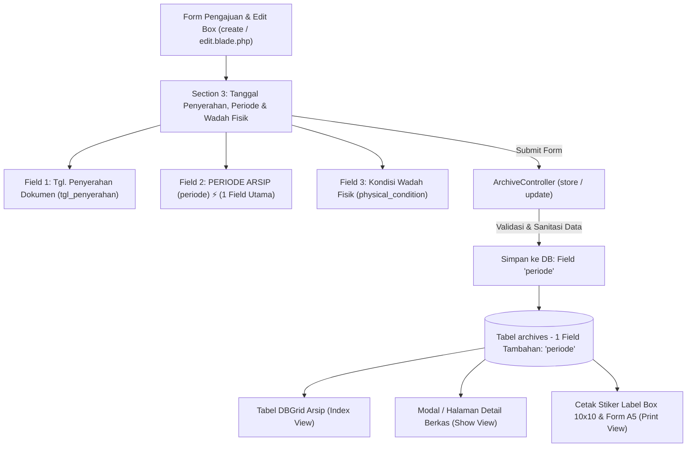

# DOKUMEN REVISI FITUR SISTEM ARSIP DIGITAL (REVISI 3)
**Project:** Indraco Arsip (Laravel 7)  
**Path:** `C:\laragon\www\#Project2026\indraco-arsip-laravel-7`  
**Tanggal:** 06 Oktober 2026  
**Status Dokumen:** Rencana Kerja & Spesifikasi Implementasi Fitur (Penyederhanaan Skema: Penambahan 1 Field Periode Dokumen Tanpa Perubahan Makro Database)

---

## 1. LATAR BELAKANG & TUJUAN FITUR

Pada operasional manajemen arsip fisik di PT Indraco, pencatatan waktu dan rentang dokumen pada setiap kardus/box arsip membutuhkan standarisasi yang jelas dan mudah dioperasikan oleh PIC Departemen maupun PIC Gudang.

### Prinsip Utama Revisi 3:
1. **Tidak Ada Perubahan Database Secara Makro:**
   - Menghindari perombakan skema tabel secara masif, konversi kolom yang rumit, ataupun pembuatan relasi multi-tabel baru yang berisiko merusak data yang telah berjalan.
   - Database tetap stabil, bersih (*lean*), dan mempertahankan kompatibilitas penuh dengan data arsip lama.
2. **Penambahan Hanya 1 Field Periode:**
   - Fokus utama perubahan skema database adalah penambahan **1 field tunggal `periode`** (bertipe `VARCHAR`/`STRING`, *nullable*) pada tabel arsip untuk mencatat identitas periode dokumen secara fleksibel, ringkas, dan seragam (contoh format: `YYYY/MM`, `YYYY/MM - YYYY/MM`, atau teks periode deskriptif).
3. **Efisiensi Pengisian & Tampilan Terpadu:**
   - PIC Pengaju dapat menginputkan periode dokumen kardus secara langsung dan jelas di Form Pengajuan Box (`create.blade.php` & `edit.blade.php`).
   - Field `periode` ditampilkan secara seragam pada seluruh modul: Tabel Katalog Arsip (`index`), Detail Berkas (`show`), dan Cetak Stiker/Label Box 10x10 & Form A5 (`print_sticker`).

---

## 2. ARSITEKTUR & ALUR DATA (MINIMALIS & NON-MAKRO)



---

## 3. SPESIFIKASI PERUBAHAN & DETAIL TEKNIS

### A. Perubahan Skema Database (Database Migration)
Sesuai arahan agar tidak melakukan perubahan makro, migrasi hanya menambahkan **1 field `periode`** pada tabel `archives`:

1. **File Migration:** `database/migrations/2026_10_06_000001_add_periode_to_archives_table.php`
2. **Definisi Kolom:**
   ```php
   Schema::table('archives', function (Blueprint $table) {
       // Menambahkan 1 field periode tunggal (string, nullable)
       $table->string('periode', 100)->nullable()->after('title')->comment('Periode dokumen/arsip box');
   });
   ```
3. **Rollback Migration (Down):**
   ```php
   Schema::table('archives', function (Blueprint $table) {
       $table->dropColumn('periode');
   });
   ```

---

### B. Perubahan Model `Archive.php`
1. **Fillable Array:**
   - Menambahkan `'periode'` ke dalam `$fillable`.
2. **Accessor / Helper Display:**
   - Memastikan pemanggilan `$archive->periode` menghasilkan string periode yang rapi.
   - Helper fallback: Jika `periode` belum terisi pada data lama, otomatis mengambil fallback dari `periode_doc`, `period_text`, atau tanggal penyerahan.

---

### C. Antarmuka Form Pengajuan & Edit Box (`create.blade.php` & `edit.blade.php`)

Pada **SECTION 3: TANGGAL PENYERAHAN, PERIODE & WADAH FISIK BOX**:
1. **Layout Input Rapi & Terstruktur (3 Kolom):**
   - **Kolom 1: TGL. PENYERAHAN DOKUMEN** (`tgl_penyerahan`)
     - Input date (maksimal hari ini).
   - **Kolom 2: PERIODE DOKUMEN (BULAN)** (`periode_bulan` / `periode`)
     - Input angka bulan dengan suffix *Bulan* (contoh: `1 Bulan`, `3 Bulan`, `4 Bulan`, `15 Bulan`, dll.).
     - Dilengkapi deretan tombol cepat (*quick preset chips*): `1 Bln`, `3 Bln`, `4 Bln`, `6 Bln`, `12 Bln`, `15 Bln`, `24 Bln`, `60 Bln`.
   - **Kolom 3: KONDISI / WADAH FISIK BERKAS** (`physical_condition`)
     - Input spesifikasi wadah fisik (default: `Baik / Box Karton Standar TB 30g`).

---

### D. Perubahan Backend Controller (`ArchiveController.php`)

1. **Method `store(Request $request)` & `update(Request $request, Archive $archive)`:**
   - **Validasi Input:**
     ```php
     'periode' => 'nullable|string|max:100',
     'tgl_penyerahan' => 'required|date|before_or_equal:today',
     'physical_condition' => 'required|string|max:100',
     ```
   - **Penyimpanan:**
     - Simpan langsung value field `periode` ke model `Archive` tanpa transformasi kompleks yang memberatkan sistem.

---

### E. Integrasi View Tampilan (Index, Detail Show, & Print Label)

1. **`resources/views/archives/index.blade.php` (DBGrid Table):**
   - Menampilkan kolom **PERIODE** dengan format teks yang jelas pada baris daftar arsip.
2. **`resources/views/archives/show.blade.php` (Detail View):**
   - Menampilkan informasi **Periode Berkas / Dokumen** pada panel ringkasan identitas box.
3. **`resources/views/archives/print_sticker.blade.php` (Cetak Label Stiker 10x10 & Form A5):**
   - Menampilkan data `periode` pada template cetak label box kardus secara proporsional dan mudah dibaca oleh staf gudang.

---

## 4. CHECKLIST RENCANA IMPLEMENTASI

- [x] **Langkah 1: Database Migration**  
  Buat migration `2026_10_06_000001_add_periode_to_archives_table.php` (hanya menambahkan 1 field `periode`) dan jalankan `php artisan migrate`.

- [x] **Langkah 2: Update Model `Archive.php`**  
  Tambahkan `'periode'` ke `$fillable` dan siapkan helper accessor yang backward-compatible.

- [x] **Langkah 3: Update Controller `ArchiveController.php`**  
  Sesuaikan validasi dan mapping field `periode` pada method `store()` dan `update()`.

- [x] **Langkah 4: Update Form Pengajuan & Edit (`create.blade.php` & `edit.blade.php`)**  
  Terapkan input field `periode` pada Section 3 dengan layout responsif dan bersih.

- [x] **Langkah 5: Update Tampilan Data (`index.blade.php`, `show.blade.php`, & `print_sticker.blade.php`)**  
  Tampilkan field `periode` secara seragam pada tabel daftar, modal detail, dan cetak label stiker.

- [x] **Langkah 6: Validasi & Pengujian**  
  Uji coba penginputan arsip baru, edit arsip, verifikasi kelengkapan data di database, dan pastikan tidak ada efek samping pada fitur yang sudah ada.

---
*Dokumen ini telah diperbarui sesuai arahan: struktur database dipertahankan tetap stabil dan ramping (hanya menambahkan 1 field periode).*
