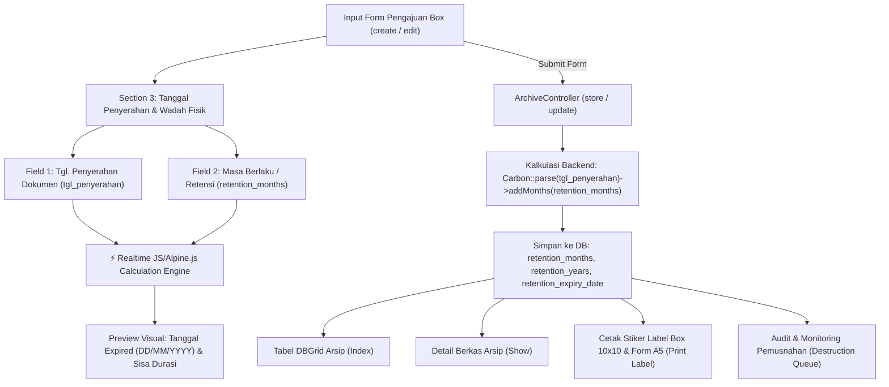

# DOKUMEN REVISI FITUR SISTEM ARSIP DIGITAL (REVISI 3)
**Project:** Indraco Arsip (Laravel 7)  
**Path:** `C:\laragon\www\#Project2026\indraco-arsip-laravel-7`  
**Tanggal:** 05 Oktober 2026  
**Status Dokumen:** Rencana Kerja & Spesifikasi Implementasi Fitur (Penambahan Field Masa Berlaku dalam Bulan & Kalkulasi Otomatis Dokumen Expired Berdasarkan Tanggal Penyerahan)

---

## 1. LATAR BELAKANG & TUJUAN FITUR

Pada alur manajemen arsip fisik di PT Indraco, penentuan masa simpan aktif (*retention period*) dan tanggal jatuh tempo pemusnahan/kadaluarsa (*retention expiry date*) sangat bergantung pada waktu penyerahan fisik berkas ke Gudang Arsip.

Sebelumnya, penentuan masa simpan diatur dalam satuan tahun baku (misal 5 tahun) atau inherit dari departemen. Namun pada kebutuhan operasional lapangan:
1. Beberapa dokumen operasional memiliki masa berlaku yang lebih spesifik dalam hitungan **bulan** (misal: *6 bulan*, *12 bulan / 1 tahun*, *18 bulan*, *24 bulan / 2 tahun*, *36 bulan / 3 tahun*, *60 bulan / 5 tahun*).
2. Acuan perhitungan tanggal kadaluarsa (*expiry date*) harus dihitung secara presisi dari:
   $$\text{Tanggal Expired} = \text{Tanggal Penyerahan Dokumen} + \text{Masa Berlaku (Bulan)}$$
3. Pengguna/PIC Pengaju membutuhkan **real-time visual feedback** di form pengajuan box arsip yang langsung menampilkan kalkulasi tanggal jatuh tempo kadaluarsa saat menginput tanggal penyerahan dan durasi masa berlaku.

---

## 2. ARSITEKTUR & ALUR LOGIKA KALKULASI



---

## 3. SPESIFIKASI PERUBAHAN & DETAIL TEKNIS

### A. Perubahan Skema Database (Database Migration)
1. **Migration Baru:** `database/migrations/2026_10_05_000001_add_retention_months_to_archives_table.php`
   - Menambahkan kolom `retention_months` (integer, unsigned, default: 60) pada tabel `archives`.
   - Melakukan migrasi data lama: mengisi `retention_months = retention_years * 12` untuk data arsip yang telah ada sebelumnya.

```php
Schema::table('archives', function (Blueprint $table) {
    $table->unsignedInteger('retention_months')->default(60)->after('retention_years')->comment('Masa simpan dalam satuan bulan');
});
```

---

### B. Perubahan Model `Archive.php`
1. **Fillable & Casts:**
   - Menambahkan `'retention_months'` ke dalam array `$fillable`.
   - Menambahkan `'retention_months' => 'integer'` ke dalam array `$casts`.
2. **Accessors & Helper Methods:**
   - `getFormattedRetentionPeriodAttribute()`: Menghasilkan label format masa berlaku (contoh: `"12 Bulan (1 Tahun)"` atau `"18 Bulan (1.5 Tahun)"` atau `"6 Bulan"`).
   - `getEffectiveRetentionMonthsAttribute()`: Mengambil `retention_months` atau default konversi dari `retention_years * 12` atau fallback `60`.
   - `getCalculatedExpiryDateAttribute()`: Helper getter `tgl_penyerahan + retention_months`.

---

### C. Antarmuka Form Pengajuan & Edit Box Arsip (`create.blade.php` & `edit.blade.php`)

Pada **SECTION 3: TANGGAL PENYERAHAN & WADAH FISIK BOX**:
1. **Layout Grid 3 Kolom:**
   - **Kolom 1: TGL. PENYERAHAN DOKUMEN** (`tgl_penyerahan`)
     - Input date (maksimal hari ini / tanggal serah terima fisik).
     - Reaktif mentrigger update tanggal kadaluarsa.
   - **Kolom 2: MASA BERLAKU / RETENSI ARSIP (BULAN)** (`retention_months`)
     - Input number (dalam bulan, minimal 1 bulan, default: 60 bulan / 5 tahun).
     - **Preset Quick-Click Buttons:**
       - `6 Bln` (0.5 Thn)
       - `12 Bln` (1 Thn)
       - `24 Bln` (2 Thn)
       - `36 Bln` (3 Thn)
       - `60 Bln` (5 Thn)
       - `120 Bln` (10 Thn)
     - **Live Calculated Preview Banner (Alpine.js):**
       - Menampilkan kartu/badge kalkulasi otomatis:
         - **Tanggal Expired:** `DD/MM/YYYY` (contoh: *05/10/2027*)
         - **Estimasi:** *1 Tahun (12 Bulan)*
         - **Status:** *Aktif / Berlaku*
   - **Kolom 3: KONDISI / WADAH FISIK BERKAS** (`physical_condition`)
     - Input teks spesifikasi wadah fisik (default: `Baik / Box Karton Standar TB 30g`).

---

### D. Perubahan Backend Controller (`ArchiveController.php`)

1. **Method `store(Request $request)` & `update(Request $request, Archive $archive)`:**
   - **Validasi Input:**
     ```php
     'retention_months' => 'required|integer|min:1|max:600',
     ```
   - **Kalkulasi Tanggal Expired:**
     ```php
     $tglPenyerahan = Carbon::parse($validated['tgl_penyerahan']);
     $retentionMonths = (int) $validated['retention_months'];
     $retentionYears = (int) ceil($retentionMonths / 12);
     
     // Tanggal Expired dihitung dari tgl_penyerahan + masa berlaku dalam bulan
     $retentionExpiryDate = $tglPenyerahan->copy()->addMonths($retentionMonths)->format('Y-m-d');
     ```
   - **Penyimpanan:**
     - Simpan `retention_months`, `retention_years`, dan `retention_expiry_date`.

---

### E. Integrasi View Lainnya (Index, Show, Print Label, & Destructions)

1. **`resources/views/archives/index.blade.php` (DBGrid Table):**
   - Kolom **MASA SIMPAN (EXPIRY)** menampilkan info durasi bulan/tahun dan tanggal expired hasil kalkulasi, dengan highlight badge jika status *Expiring Soon* (<= 90 hari) atau *Expired*.
2. **`resources/views/archives/show.blade.php` (Detail View):**
   - Panel **Masa Simpan & Expiry** menampilkan:
     - Durasi Retensi: `X Bulan (Y Tahun)`
     - Tanggal Penyerahan: `DD/MM/YYYY`
     - Tanggal Jatuh Tempo / Pemusnahan: `DD/MM/YYYY`
     - Sisa Waktu / Status Kadaluarsa.
3. **`resources/views/archives/print_sticker.blade.php` (Cetak Label A5 & Stiker 10x10):**
   - Menampilkan informasi Masa Berlaku (Bulan/Tahun) dan Tanggal Kadaluarsa secara proporsional.

---

## 4. CHECKLIST RENCANA IMPLEMENTASI

- [ ] **Langkah 1:** Buat file migrasi `2026_10_05_000001_add_retention_months_to_archives_table.php` dan jalankan `php artisan migrate`.
- [ ] **Langkah 2:** Perbarui model `App\Models\Archive` (fillable, casts, helper accessors).
- [ ] **Langkah 3:** Perbarui `ArchiveController.php` pada method `store` dan `update` untuk memvalidasi dan mengkalkulasi `retention_expiry_date` dari `tgl_penyerahan + retention_months`.
- [ ] **Langkah 4:** Perbarui antarmuka Form Input `resources/views/archives/create.blade.php` (Section 3: field input bulan, preset buttons, live calculation preview Alpine.js).
- [ ] **Langkah 5:** Perbarui antarmuka Form Edit `resources/views/archives/edit.blade.php` (Section 3: sync data bulan & live calculation preview).
- [ ] **Langkah 6:** Perbarui tampilan detail `resources/views/archives/show.blade.php`, index `resources/views/archives/index.blade.php`, dan cetak label `resources/views/archives/print_sticker.blade.php`.
- [ ] **Langkah 7:** Uji coba end-to-end (pengisian form pengajuan baru, edit data, cek hasil kalkulasi tanggal expired, dan filter dokumen kadaluarsa).

---
*Dokumen ini dibuat sebagai panduan teknis implementasi Revisi 3 Sistem DMS Indraco Arsip (Laravel 7).*
