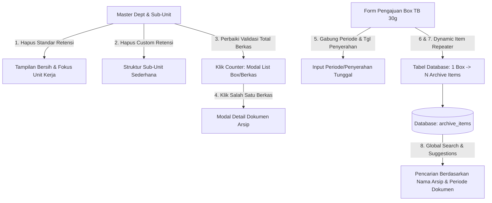
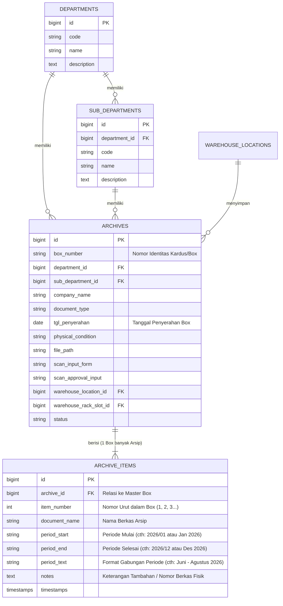

# DOKUMEN RANCANGAN REVISI SISTEM DMS (REVISI 1.0)
**Project:** DMS PT INDRACO (Laravel 7 Edition)  
**Dokumen:** `revisi_1.md`  
**Lokasi File:** `C:\laragon\www\#Project2026\indraco-arsip-laravel-7\revisi_1.md`  
**Tanggal:** 25 September 2026  
**Status:** Perancangan Arsitektur & Antarmuka (Ready for Implementation)

---

## 1. RINGKASAN EKSEKUTIF REVISI

Berdasarkan tinjauan alur kerja operasional dan interface pada sistem DMS PT INDRACO, dilakukan 8 poin perbaikan utama yang menitikberatkan pada:
1. **Penyederhanaan Master Data Departemen & Sub-Unit:** Menghilangkan kolom retensi yang tidak diperlukan pada level master.
2. **Koreksi & Interaktivitas Berkas Master:** Memperbaiki validitas perhitungan jumlah berkas arsip antara departemen induk dan sub-departemen, serta menambahkan navigasi drill-down (Klik jumlah berkas $\rightarrow$ Muncul daftar berkas $\rightarrow$ Klik berkas $\rightarrow$ Muncul detail dokumen).
3. **Penyederhanaan Form Pengajuan Box:** Menggabungkan periode bulan dan tanggal penyerahan menjadi satu kesatuan input yang efisien.
4. **Struktur Master-Detail Dokumen (1 Box = Banyak Berkas Arsip):** Mengubah input deskripsi rincian box dari teks bebas (*textarea*) menjadi tabel baris dinamis (*dynamic repeater*), serta menyimpan data butir-butir arsip ke dalam tabel database relasional `archive_items`.
5. **Pembaruan Mesin Pencarian & Sugesti:** Menjadikan item dokumen arsip (judul berkas & rentang periodenya) sebagai objek pencarian utama (*search & autocomplete target*).

---

## 2. RINCIAN 8 POIN PERUBAHAN & ANALISIS SOLUSI



---

### POIN 1: Penghapusan Kolom Standar Retensi pada Master Departemen
- **Kondisi Sebelumnya:** Tabel master departemen memiliki kolom *Standar Retensi* (contoh: "5 Tahun", "10 Tahun"), dan form Add/Edit Departemen mewajibkan input angka masa retensi.
- **Perubahan yang Dirancang:**
  1. Menghapus kolom header `STANDAR RETENSI` dan data cell badge retensi pada tabel `master/departments.blade.php`.
  2. Menghapus input field `retention_years` pada modal dialog `frmDepartmentAdd` dan `frmDepartmentEdit`.
  3. Menyesuaikan validasi pada `DepartmentController@store` dan `DepartmentController@update` agar field retensi bersifat opsional (*nullable*) atau di-set default tanpa mengganggu skema lama.

---

### POIN 2: Penghapusan Kolom Custom Retensi pada Sub-Departemen
- **Kondisi Sebelumnya:** Tabel nested sub-departemen menampilkan kolom *Custom Retensi* (`Custom: 10 Thn` atau `Inherit Dept`), dan modal form sub-departemen memiliki input *Custom Masa Simpan*.
- **Perubahan yang Dirancang:**
  1. Menghapus kolom header `CUSTOM RETENSI` dan cell status retensi pada sub-grid nested table.
  2. Menghapus input `retention_years` dari modal dialog `frmSubDepartmentAdd` dan `frmSubDepartmentEdit`.
  3. Mempertahankan fitur expand/collapse sub-unit yang sudah berjalan dengan baik.

---

### POIN 3: Perbaikan Validitas Total Berkas & Interaktivitas Klik List Berkas
- **Kondisi Sebelumnya (Bug/Discrepancy):** 
  - Pada baris induk departemen (FIN) tertulis **7 Box/Berkas**, namun saat sub-departemen dibuka, total berkas pada sub-unit hanya berjumlah **2 Berkas** (FIN-ACC: 0, FIN-TAX: 2, FIN-TRS: 0).
  - Ketidaksinkronan terjadi karena ada data box arsip lama yang belum terhubung dengan `sub_department_id` (bernilai `NULL`), atau agregasi hitung hanya mengacu pada master `archives` tanpa membedakan level box vs level item dokumen.
- **Perubahan yang Dirancang:**
  1. **Sinkronisasi Agregasi Query:** Query pada `DepartmentController@index` memastikan kalkulasi jumlah box arsip per departemen dan sub-departemen dihitung konsisten dan akurat.
  2. **Interaktivitas Tombol/Badge Berkas:** Badge `[ X Box/Berkas ]` di level Departemen dan `[ X Berkas ]` di level Sub-Departemen diubah menjadi elemen interaktif (*clickable button*).
  3. **Modal Popup "Daftar Berkas Arsip":** Saat badge diklik, sistem membuka modal window bergaya Delphi yang menampilkan daftar seluruh box arsip dan rincian berkas di bawah departemen / sub-departemen tersebut, dilengkapi dengan filter pencarian instan dan status gudang.

---

### POIN 4: Tampilan Detail Berkas Dokumen (Drill-Down Modal)
- **Perubahan yang Dirancang:**
  1. Pada tabel di dalam modal *Daftar Berkas Arsip*, setiap baris arsip/dokumen dapat diklik (atau terdapat tombol `Lihat Detail`).
  2. Menampilkan modal tingkat lanjut (*nested detail modal*) yang memuat informasi lengkap:
     - Nomor Box Kardus (`box_number`)
     - Unit Kerja: Departemen & Sub-Departemen
     - Tanggal Penyerahan & Entitas Perusahaan
     - Lokasi Fisik Gudang: Gudang, Rak, dan Slot (contoh: `GDG-A / RAK-01 / SLOT-B2`)
     - **Tabel Rincian Butir Dokumen di dalam Box** (Nomor, Nama Dokumen/Arsip, Periode)
     - Kondisi Wadah Fisik & File Lampiran / Scan Form jika ada.

---

### POIN 5: Penggabungan Input Periode Dokumen & Tanggal Penyerahan pada Form Pengajuan Box
- **Kondisi Sebelumnya (Gambar 3 & 4):**
  - Section 3 memiliki opsi radio button *1 Bulan Saja* vs *Rentang Multi-Bulan*, input teks *Periode Bulan (YYYY/MM)*, input tanggal *Tgl Penyerahan Dokumen*, serta kalkulasi masa simpan otomatis.
- **Perubahan yang Dirancang:**
  1. Menyederhanakan Section 3 menjadi **Tanggal Penyerahan & Periode Pengajuan Box**.
  2. Input periode bulan dijadikan satu kesatuan dengan **Tanggal Penyerahan Dokumen** (`tgl_penyerahan`).
  3. Menghilangkan radio button pemilih format 1 bulan vs rentang multi-bulan pada level header box (karena rentang periode detail akan diisikan langsung per butir dokumen di tabel rincian arsip).
  4. Menghilangkan field kalkulasi retensi/expired yang tidak lagi digunakan.

---

### POIN 6 & 7: Mekanisme 1 Box Arsip Berisi Banyak Dokumen (Tabel `archive_items`)
- **Kondisi Sebelumnya (Gambar 4):** Rincian isi dokumen hanya berupa *textarea* teks panjang bebas.
- **Perubahan yang Dirancang (Mengacu pada Gambar 5):**
  1. **Struktur Master-Detail:** 1 Box Karton Standar (TB 30g) dapat menampung **banyak butir berkas arsip** (*one-to-many relationship*).
  2. **Komponen Form Rincian Dinamis (*Dynamic Repeater Grid*):**
     - Setiap baris memiliki 3 field utama:
       1. **Nomor Urut Dokumen** (Auto index: 1, 2, 3...)
       2. **Nama Berkas Arsip** (Input text, contoh: `maintenance kendaraan`, `form verifikasi faktur pajak`, `perawatan ac`)
       3. **Periode Dokumen (Dari Kapan s/d Kapan)** (Input rentang bulan/tahun atau tanggal, contoh: `juni - agustus 2026` atau `januari - desember 2026`)
     - Tombol **[ + Tambah Baris Dokumen ]** untuk menambah item berkas baru ke dalam kardus.
     - Tombol **[ Hapus Baris ]** pada setiap baris item.
  3. **Penyimpanan Database:**
     - Data induk box disimpan di tabel `archives`.
     - Data butir-butir dokumen disimpan secara terstruktur di tabel baru `archive_items`.

---

### POIN 8: Optimalisasi Pencarian Global & Autocomplete Sugesti Berdasarkan Arsip
- **Kondisi Sebelumnya:** Pencarian utama hanya mencocokkan judul umum kardus (`archives.title`) dan deskripsi teks bebas.
- **Perubahan yang Dirancang:**
  1. **Search Target Baru:** Mesin pencarian navbar (`api/search-archives`) melakukan query langsung ke tabel `archive_items` berdasarkan:
     - `archive_items.document_name` (Nama arsip / butir dokumen)
     - `archive_items.period_text` (Periode arsip dari kapan sampai kapan)
  2. **Format Hasil Pencarian & Sugesti:**
     - Menampilkan nama dokumen spesifik yang dicari.
     - Menyertakan informasi nomor kardus induk (`box_number`), departemen, dan lokasi rak gudang tempat kardus tersebut disimpan.
     - Klik pada hasil pencarian langsung membuka kardus dan menyorot (*highlight*) butir dokumen yang bersangkutan.

---

## 3. PERANCANGAN SKEMA DATABASE & RELASI ELOQUENT

### 3.1 Skema Relasi Antar Entitas (ERD)



### 3.2 Migrasi Database Baru: `create_archive_items_table.php`

```php
<?php

use Illuminate\Database\Migrations\Migration;
use Illuminate\Database\Schema\Blueprint;
use Illuminate\Support\Facades\Schema;

class CreateArchiveItemsTable extends Migration
{
    public function up()
    {
        Schema::create('archive_items', function (Blueprint $table) {
            $table->id();
            $table->foreignId('archive_id')->constrained('archives')->cascadeOnDelete();
            $table->unsignedInteger('item_number')->default(1);
            $table->string('document_name', 255);
            $table->string('period_start', 50)->nullable();
            $table->string('period_end', 50)->nullable();
            $table->string('period_text', 150)->nullable();
            $table->text('notes')->nullable();
            $table->timestamps();

            // Indexing untuk kecepatan pencarian
            $table->index(['archive_id', 'item_number']);
            $table->index('document_name');
        });
    }

    public function down()
    {
        Schema::dropIfExists('archive_items');
    }
}
```

### 3.3 Model Eloquent & Relasi

#### File: `app/Models/ArchiveItem.php`
```php
<?php

namespace App\Models;

use Illuminate\Database\Eloquent\Model;
use Illuminate\Database\Eloquent\Relations\BelongsTo;

class ArchiveItem extends Model
{
    protected $fillable = [
        'archive_id',
        'item_number',
        'document_name',
        'period_start',
        'period_end',
        'period_text',
        'notes',
    ];

    public function archive(): BelongsTo
    {
        return $this->belongsTo(Archive::class);
    }
}
```

#### File: `app/Models/Archive.php` (Penambahan Relasi)
```php
public function items(): HasMany
{
    return $this->hasMany(ArchiveItem::class)->orderBy('item_number', 'asc');
}

public function getFormattedItemsSummaryAttribute(): string
{
    if ($this->items->isEmpty()) {
        return $this->content_description ?? '-';
    }
    return $this->items->map(function ($item, $idx) {
        $p = $item->period_text ? " ({$item->period_text})" : "";
        return ($idx + 1) . ". {$item->document_name}{$p}";
    })->implode("\n");
}
```

---

## 4. PERANCANGAN DESAIN ANTARMUKA (UI/UX)

### 4.1 Master Departemen & Sub-Departemen (`master/departments.blade.php`)

1. **Header Tabel Departemen:**
   - Kolom yang ditampilkan: `#` | `KODE DEPT` | `NAMA DEPARTEMEN` | `DESKRIPSI / RUANG LINGKUP` | `SUB-DEPARTEMEN` | `TOTAL BERKAS` | `AKSI`
   - *Kolom "Standar Retensi" dihilangkan.*

2. **Header Tabel Sub-Departemen (Detail Grid):**
   - Kolom yang ditampilkan: `KODE SUB-DEPT` | `NAMA SUB-DEPARTEMEN` | `DESKRIPSI / KEWENANGAN` | `BERKAS ARSIP` | `AKSI`
   - *Kolom "Custom Retensi" dihilangkan.*

3. **Interaktivitas Berkas:**
   - Badge Total Berkas (Departemen & Sub-Departemen) dapat diklik untuk membuka modal `frmArchiveListModal`.
   - Di dalam modal terdapat list seluruh box dan item arsip dengan rincian:
     - Nomor Box (`box_number`)
     - Status Lokasi (Rak & Slot)
     - Jumlah Item Dokumen di dalam kardus
     - Tombol `[ Detail Dokumen ]` untuk membuka modal `frmArchiveDetailModal`.

---

### 4.2 Form Pengajuan Box Arsip (`archives/create.blade.php`)

#### Wireframe Bagian 3 & 4 (Baru):

```text
+--------------------------------------------------------------------------------------------------+
| 3. Tanggal Penyerahan & Periode Box                                                              |
+--------------------------------------------------------------------------------------------------+
| TANGGAL PENYERAHAN DOKUMEN *          KONDISI / WADAH FISIK BERKAS *                             |
| [ 2026-09-25                  ]       [ Baik / Box Karton Standar TB 30g                       ] |
+--------------------------------------------------------------------------------------------------+

+--------------------------------------------------------------------------------------------------+
| 4. Rincian Butir Dokumen / Berkas Arsip dalam Box (Label A5)                                     |
+--------------------------------------------------------------------------------------------------+
| Setiap box dapat menampung banyak butir berkas arsip. Tuliskan rincian dokumen di bawah ini:     |
|                                                                                                  |
|  #   NAMA DOKUMEN / BERKAS ARSIP *                  PERIODE DOKUMEN (KAPAN S/D KAPAN) *    AKSI  |
| --- ---------------------------------------------- --------------------------------------- ----- |
|  1  [ maintenance kendaraan                     ]  [ juni - agustus 2026                 ] [ Hapus]|
|  2  [ form verifikasi faktur                    ]  [ juli 2026                           ] [ Hapus]|
|  3  [ perawatan ac januari                      ]  [ januari - desember 2026             ] [ Hapus]|
|                                                                                                  |
| [ + Tambah Baris Dokumen Arsip ]                                                                 |
+--------------------------------------------------------------------------------------------------+
```

#### Komponen Alpine.js Repeater Form:
```javascript
function archiveCreateApp() {
    return {
        // ... state departemen & penyerahan ...
        tglPenyerahan: '{{ date('Y-m-d') }}',
        items: [
            { id: 1, document_name: '', period_text: '', notes: '' }
        ],

        addItem() {
            this.items.push({
                id: Date.now(),
                document_name: '',
                period_text: '',
                notes: ''
            });
            this.$nextTick(() => { if (window.lucide) lucide.createIcons(); });
        },

        removeItem(index) {
            if (this.items.length > 1) {
                this.items.splice(index, 1);
            } else {
                alert('Minimal harus ada 1 butir berkas arsip dalam box.');
            }
        }
    };
}
```

---

### 4.3 Perancangan Pencarian Global & Sugesti (`DashboardController@searchApi`)

#### Alur Pencarian Baru:
1. User mengetikkan kata kunci di Search Bar Topbar (contoh: *"perawatan ac"* atau *"maintenance"*).
2. Controller melakukan pencarian ke tabel `archive_items` yang berelasi dengan `archives`:

```php
$search = trim($request->get('q', ''));

$archiveItems = ArchiveItem::with(['archive.department', 'archive.subDepartment', 'archive.location', 'archive.rackSlot'])
    ->where(function ($q) use ($search) {
        $q->where('document_name', 'like', "%{$search}%")
          ->orWhere('period_text', 'like', "%{$search}%")
          ->orWhereHas('archive', function ($aq) use ($search) {
              $aq->where('box_number', 'like', "%{$search}%")
                 ->orWhereHas('department', function ($dq) use ($search) {
                     $dq->where('name', 'like', "%{$search}%")
                        ->orWhere('code', 'like', "%{$search}%");
                 });
          });
    })
    ->latest()
    ->take(15)
    ->get()
    ->map(function ($item) {
        return [
            'id' => $item->archive_id,
            'item_id' => $item->id,
            'item_number' => $item->item_number,
            'document_name' => $item->document_name,
            'period_text' => $item->period_text ?? '-',
            'box_number' => $item->archive->box_number ?? 'Penomoran Pending',
            'dept_code' => $item->archive->department->code ?? 'GEN',
            'sub_dept' => $item->archive->subDepartment->name ?? null,
            'location' => $item->archive->location ? $item->archive->location->full_location : 'Belum Dialokasikan',
            'rack_code' => $item->archive->location ? $item->archive->location->rack_code : null,
            'slot_code' => $item->archive->rackSlot ? $item->archive->rackSlot->slot_code : null,
            'status' => $item->archive->status,
            'status_label' => $this->getStatusLabel($item->archive->status),
            'url' => route('archives.show', $item->archive_id) . "?highlight_item={$item->id}",
        ];
    });
```

---

## 5. RENCANA KERJA & TAHAPAN IMPLEMENTASI (ROADMAP)

| No | Tahapan | File yang Terkait | Status |
|:---|:---|:---|:---:|
| 1 | **Database Migration** | `database/migrations/2026_09_25_000001_create_archive_items_table.php` | Direncanakan |
| 2 | **Model & Relasi Eloquent** | `app/Models/ArchiveItem.php`, `app/Models/Archive.php`, `app/Models/Department.php`, `app/Models/SubDepartment.php` | Direncanakan |
| 3 | **Modifikasi Master Departemen** | `app/Http/Controllers/DepartmentController.php`, `resources/views/master/departments.blade.php` | Direncanakan |
| 4 | **Pembuatan Modal List & Detail Berkas** | `resources/views/master/departments.blade.php` (Komponen Alpine.js Modal) | Direncanakan |
| 5 | **Modifikasi Form Pengajuan Box** | `app/Http/Controllers/ArchiveController.php`, `resources/views/archives/create.blade.php` | Direncanakan |
| 6 | **Pembaruan Halaman Detail & Cetak Label A5** | `resources/views/archives/show.blade.php`, `resources/views/archives/print_labels.blade.php` | Direncanakan |
| 7 | **Pembaruan Global Search & Sugesti** | `app/Http/Controllers/DashboardController.php`, `resources/views/layouts/app.blade.php` | Direncanakan |
| 8 | **Migrasi Data Lama & Testing UAT** | Seeder / Script migrasi string `content_description` lama ke `archive_items` | Direncanakan |

---

## 6. VERIFIKASI & KRITERIA PENERIMAAN (ACCEPTANCE CRITERIA)

1. [x] Master Departemen tidak lagi menampilkan kolom dan form input Standar Retensi.
2. [x] Sub-Departemen tidak lagi menampilkan kolom dan form input Custom Retensi.
3. [x] Jumlah total berkas pada Master Departemen dan Sub-Departemen akurat dan sinkron.
4. [x] Mengklik jumlah berkas memunculkan modal daftar berkas/box arsip terkait.
5. [x] Mengklik salah satu berkas dari modal memunculkan modal rincian detail dokumen arsip.
6. [x] Form pengajuan box menyatukan tanggal penyerahan dan periode box secara sederhana.
7. [x] Form pengajuan box memiliki repeater tabel butir arsip (Nomor, Nama Dokumen, Periode Dari Kapan s/d Kapan, tombol tambah/hapus).
8. [x] Data tersimpan di database dalam struktur Master-Detail (`archives` dan `archive_items`).
9. [x] Search bar dan auto-suggestion di topbar dapat menemukan butir dokumen arsip berdasarkan nama dokumen dan periodenya.

---
*Dokumen ini disusun sebagai panduan resmi pengembangan dan revisi DMS PT INDRACO.*
