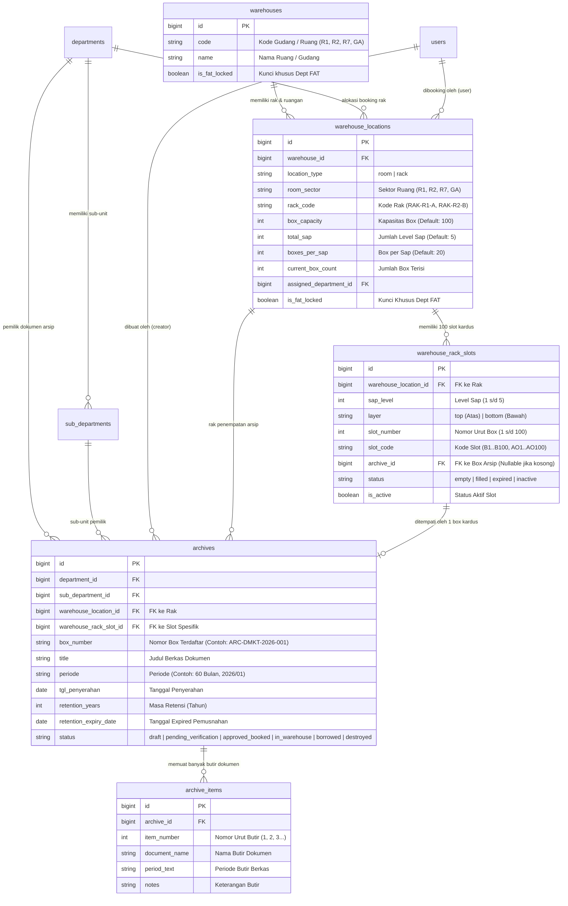

# Catatan Relasi Database: Ruang, Rak, Slot Box, & Arsip
**Sistem Manajemen Arsip Digital & Fisik (DMS) - PT Indraco**

Dokumen ini menjelaskan struktur data, relasi tabel database, dan hierarki fisik pengelolaan arsip gudang dari level **Ruangan/Gudang**, **Rak Fisik**, **Slot Box Kardus**, hingga **Butir Dokumen Berkas Arsip**.

---

## 1. Diagram Relasi Entitas (ERD)



---

## 2. Hierarki Fisik Penyimpanan Arsip

Hubungan fisik dari tingkat makro ke mikro tersusun secara berjenjang:

```
[ 1. RUANGAN / GUDANG ]
  └── Kode: R1, R2, R7, GA
      └── [ 2. RAK FISIK ]
            └── Kode: RAK-R1-A, RAK-R1-B, RAK-R2-J
                └── [ 3. LEVEL SAP & LAYER ] (5 Sap x 2 Layer)
                      └── SAP 1 s/d 5 (Baris Bawah: 10 Box, Baris Atas: 10 Box)
                            └── [ 4. SLOT BOX KARDUS ] (Kapasitas: 100 Slot/Rak)
                                  └── Slot Code: #1 s/d #100 (Contoh: A1, A2, ..., A100)
                                        └── [ 5. KARDUS BOX ARSIP ] (Model Archive)
                                              └── No. Box: ARC-FAT-2026-001 (Kondisi Fisik TB 30g)
                                                    └── [ 6. BUTIR BERKAS ] (Model ArchiveItem)
                                                          ├── 1. Faktur Pajak Masukan
                                                          ├── 2. Rekening Koran Januari
                                                          └── 3. Bukti Kas Keluar
```

---

## 3. Rincian Tabel & Foreign Keys

### A. Tabel `warehouses` (Ruang / Gudang)
Menyimpan identitas induk gedung atau ruangan gudang fisik.
- **Primary Key**: `id`
- **Field Kunci**:
  - `code`: Kode ruangan (`R1`, `R2`, `R7`, `GA`).
  - `name`: Nama gedung/ruangan (Contoh: `Gudang R1`, `Gudang R2`).
  - `is_fat_locked`: Boolean penanda ruang khusus departemen FAT.

---

### B. Tabel `warehouse_locations` (Objek Ruang & Rak 2D)
Menyimpan geometri 2D canvas untuk denah gudang dan konfigurasi rak fisik.
- **Primary Key**: `id`
- **Foreign Keys**:
  - `warehouse_id` $\rightarrow$ `warehouses.id` (Relasi ke master gudang).
  - `assigned_department_id` $\rightarrow$ `departments.id` (Alokasi booking departemen).
  - `booked_by_user_id` $\rightarrow$ `users.id` (User yang mem-booking).
- **Field Penting**:
  - `location_type`: `'room'` (Area Ruangan) atau `'rack'` (Rak Penyimpanan).
  - `room_sector`: Sektor ruangan tempat rak berada (`R1`, `R2`, `R7`, `GA`).
  - `rack_code`: Kode unik rak (Contoh: `RAK-R1-A`, `RAK-R2-B`).
  - `box_capacity`: Total kapasitas box (Standar: `100`).
  - `total_sap`: Jumlah tingkat rak / sap (Standar: `5`).
  - `boxes_per_sap`: Jumlah box per sap (Standar: `20` = 10 Bawah + 10 Atas).
  - `box_type`: Standar wadah kardus (Default: `'TB 30g'`).
  - `current_box_count`: Jumlah slot yang sedang terisi saat ini.
  - `is_fat_locked`: Flag kunci ruang R1 & R2 untuk departemen FAT.

---

### C. Tabel `warehouse_rack_slots` (Denah 100 Slot Box per Rak)
Menyimpan slot satuan posisi kotak/kardus arsip di dalam rak. Setiap rak berkapasitas 100 box memiliki 100 baris record slot.
- **Primary Key**: `id`
- **Foreign Keys**:
  - `warehouse_location_id` $\rightarrow$ `warehouse_locations.id` (Rak pemilik slot).
  - `archive_id` $\rightarrow$ `archives.id` (Dokumen kardus box yang menempati slot, `NULL` jika slot kosong).
- **Field Struktur Slot**:
  - `sap_level`: Tingkat sap rak (`1` = paling bawah s/d `5` = paling atas).
  - `layer`: Lapisan tumpukan (`'bottom'` = Baris Bawah, `'top'` = Baris Atas).
  - `slot_number`: Nomor index urut box dari `1` sampai `100`.
  - `slot_code`: Kode slot identifikasi (Contoh: identifier rak `B` nomor `11` $\rightarrow$ `'B11'`).
  - `status`:
    - `'empty'`: Slot kosong siap ditempati.
    - `'filled'`: Slot terisi oleh dokumen box arsip aktif.
    - `'expired'`: Slot terisi dokumen yang telah melewati masa retensi.
    - `'inactive'`: Slot dinonaktifkan sementara oleh Super Admin.
  - `is_active`: Boolean status aktif slot.

#### Standar Pembagian Nomor Slot per Rak (TB 30g - 100 Box):
| Sap Level | Baris / Layer | Rentang Nomor Box |
| :--- | :--- | :--- |
| **LVL 5** (Paling Atas) | Baris Atas (`top`) | Box #91 — #100 |
| **LVL 5** | Baris Bawah (`bottom`) | Box #81 — #90 |
| **LVL 4** | Baris Atas (`top`) | Box #71 — #80 |
| **LVL 4** | Baris Bawah (`bottom`) | Box #61 — #70 |
| **LVL 3** | Baris Atas (`top`) | Box #51 — #60 |
| **LVL 3** | Baris Bawah (`bottom`) | Box #41 — #50 |
| **LVL 2** | Baris Atas (`top`) | Box #31 — #40 |
| **LVL 2** | Baris Bawah (`bottom`) | Box #21 — #30 |
| **LVL 1** (Paling Bawah) | Baris Atas (`top`) | Box #11 — #20 |
| **LVL 1** | Baris Bawah (`bottom`) | Box #1 — #10 |

---

### D. Tabel `archives` (Kardus Box Arsip)
Menyimpan satu kesatuan fisik wadah kardus arsip yang diajukan oleh departemen.
- **Primary Key**: `id`
- **Foreign Keys**:
  - `department_id` $\rightarrow$ `departments.id` (Departemen pemilik arsip).
  - `sub_department_id` $\rightarrow$ `sub_departments.id` (Sub-unit departemen).
  - `created_by_user_id` $\rightarrow$ `users.id` (Pengaju/Creator arsip).
  - `warehouse_location_id` $\rightarrow$ `warehouse_locations.id` (Rak tempat box disimpan).
  - `warehouse_rack_slot_id` $\rightarrow$ `warehouse_rack_slots.id` (Slot presisi tempat box disimpan).
- **Field Utama**:
  - `box_number`: Kode unik kardus (Contoh: `ARC-FAT-2026-001`, `BOX-01`).
  - `title`: Judul / nama berkas arsip.
  - `periode`: Format durasi / periode (Contoh: `'60 Bulan'`, `'2026/01'`).
  - `retention_years`: Lama masa simpan dalam tahun.
  - `retention_expiry_date`: Tanggal kadaluarsa retensi dokumen.
  - `status`: Status workflow (`draft`, `pending_verification`, `approved_booked`, `in_warehouse`, `borrowed`, `destroyed`).

---

### E. Tabel `archive_items` (Butir Rincian Dokumen dalam 1 Box)
Menyimpan rincian butir-butir berkas/dokumen spesifik yang berada di dalam 1 kardus box (Relasi 1 Box $\rightarrow$ Banyak Butir Dokumen).
- **Primary Key**: `id`
- **Foreign Key**:
  - `archive_id` $\rightarrow$ `archives.id` (Induk box arsip).
- **Field Utama**:
  - `item_number`: Nomor urut butir dalam box (`1`, `2`, `3`, ...).
  - `document_name`: Uraian judul dokumen per butir.
  - `period_text`: Periode dokumen butir.
  - `notes`: Keterangan / nomor map / butir berkas.

---

## 4. Aturan Bisnis & Logika Validasi Khusus

### 1. Pembatasan Ruang R1 & R2 (Khusus Departemen FAT)
- **Ruang R1 dan R2** (`room_sector` bernilai `R1`, `R2`, atau `is_fat_locked = 1`) **hanya diperuntukkan bagi Departemen FAT** (`FIN`, `FAT`, `FATCLM`, atau nama departemen mengandung `FAT`, `KEUANGAN`, `AKUNTANSI`, `PAJAK`).
- Dokumen dari departemen lain (DMKT, DSG, HRD, LOG, dll.) **tidak dapat dipilih maupun dialokasikan** ke dalam slot rak di ruang R1 dan R2.
- **Ruangan lainnya** (R7, GA, dll.) bersifat bebas dan dapat menampung dokumen dari seluruh departemen.

### 2. Mekanisme Alokasi Dokumen ke Slot Rak
1. Saat arsip dialokasikan ke slot rak:
   - `warehouse_rack_slots.archive_id` diisi dengan `archives.id`.
   - `warehouse_rack_slots.status` berubah menjadi `'filled'`.
   - `archives.warehouse_location_id` diisi dengan `warehouse_locations.id` (ID Rak).
   - `archives.warehouse_rack_slot_id` diisi dengan `warehouse_rack_slots.id` (ID Slot).
   - `archives.status` diubah menjadi `'in_warehouse'`.
   - `warehouse_locations.current_box_count` dihitung ulang secara otomatis.
2. Saat slot dikosongkan (*Unassign*):
   - `warehouse_rack_slots.archive_id` diset menjadi `NULL`.
   - `warehouse_rack_slots.status` diset menjadi `'empty'`.
   - `archives.warehouse_rack_slot_id` diset menjadi `NULL`.
   - `warehouse_locations.current_box_count` dihitung ulang secara otomatis.
